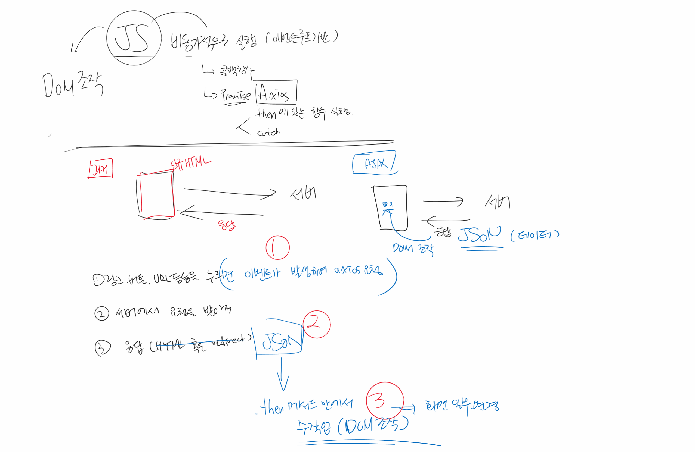
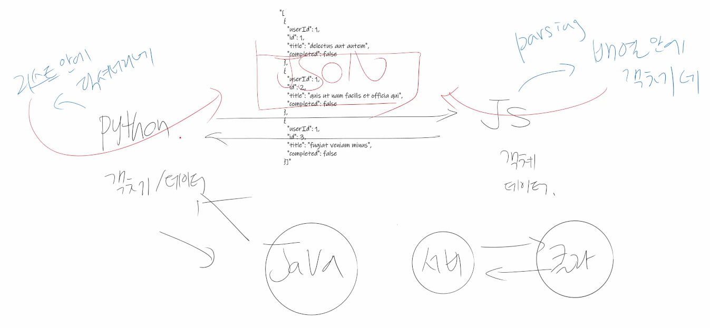
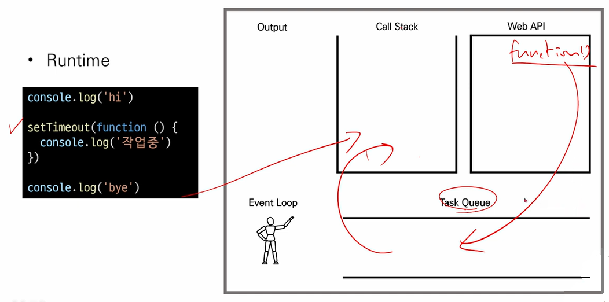
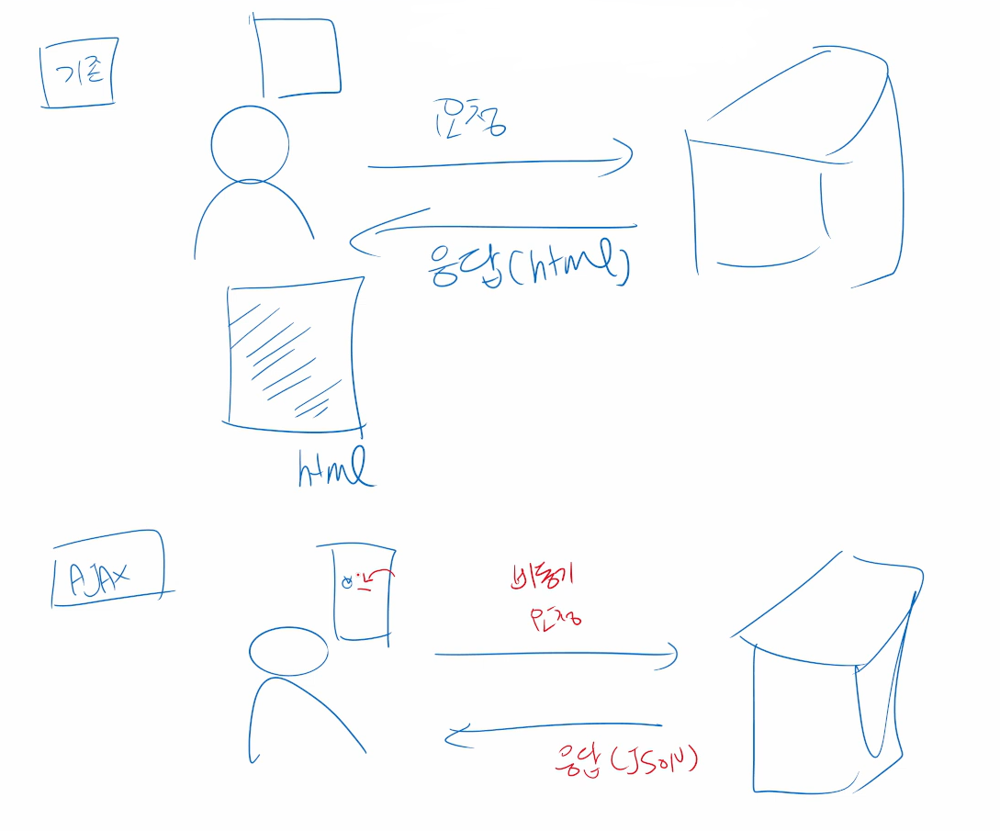

# ✅Asynchronous Programming

> 1. Asynchronous Javascript
>2. AJAX
> 3. Axios
>
> 🗂️ [실습] 좋아요, 팔로우, 댓글 기능 비동기 처리




- 들어가며
  - 최근 웹서비스는 백/프론트 가리지 않고 비동기 처리가 기본적으로 필요하기 때문에, 백엔드를 지망하는 사람도 비동기 처리, 특히 데이터를 받아서 처리하는 부분을 자유롭게 다룰 수 있어야함
  - AJAX : Asynchronous JavaScript And XML
    - AJAX 를 활용한 최초의 서비스는 Google Map
  - 구글링 하다가 $ 이 들어간 코드를 봤다면, 이건 제이쿼리인데 10년전 문법이니 안쓰는걸 권장


[9월 JS 수업 복습]

- 개발자도구 찍었을 때 consol 창에 뜨는 내용은 JavaScript 로 작성한 것 [(link)](https://github.com/code-sum/TIL/blob/master/notes/js_intro.md)

- 파이썬 pip 처럼, Node.js 도 **npm** 이라는 오픈소스 패키지(모듈)가 있음 [(link)](https://github.com/code-sum/TIL/blob/master/notes/js_intro.md)

- **DOM** 조작[(link)](https://github.com/code-sum/TIL/blob/master/notes/js_intro.md)

- 템플릿 리터럴(Template Literal) : `${expression}`  형태로 삽입 가능 [(link)](https://github.com/code-sum/TIL/blob/master/notes/js_ecma.md)

  ```javascript
  // String type
  const firstName = 'Brandan'
  const lastName = 'Eich'
  const fullName = '${firstName} ${lastName}'
  console.log(fullName)  // Brandan Eich
  ```

- 자바스크립트에서 객체는 파이썬에서 딕셔너리형과 유사 ... (js_ecma.md 필기 참조)

- (js_ecma.md 필기 참조)

  - JSON (JavaScript Object Notation) [(link)](https://developer.mozilla.org/ko/docs/Learn/JavaScript/Objects/JSON)
    - key-value 쌍의 형태로 데이터를 표기하는 언어 독립적 표준 포맷
    - JavaScript 객체와 유사하게 생겼으나 실제로는 문자열 타입
      - 따라서 JS의 객체로써 조작하기 위해서는 구문 분석(parsing)이 필수
    - JavaScript 에서는 JSON을 조작하기 위한 두 가지 내장 메서드를 제공
      - JSON.parse()
        - JSON => JavaScript 객체
      - JSON.stringify()
        - JavaScript 객체 => JSON


- JSON parse 이해하기




---


## 1. Asynchronous Javascript

> AJAX 라고 하는 기술을 이해하려면 JS 가 어떻게 동작하는지, 그리고 비동기 개념이 무엇인지 먼저 이해해야함 [(참고자료)](https://developer.mozilla.org/ko/docs/Learn/JavaScript/Asynchronous/Introducing)

- 비동기식

  - 병렬적 Task 수행

  - 요청을 보낸 후 응답을 기다리지 않고 다음 동작이 이루어짐(non-blocking)

    - 학생이 질문을 하고, 선생님이 그에 대한 답변을 준비하는 동안 학생은 선생님의 답변을 기다리기만 하고 있다면 이건 동기적 상황
    - 반대로 학생이 질문을 한 다음, 선생님의 답변 준비 시간을 마냥 기다리기만 하는 것이 아니라 TIL 정리하거나 다른 동작을 하고 있다면 이건 비동기적 상황
  
  - 요청을 보내고 응답을 기다리지 않고 다음 코드가 실행됨
  
    ```bash
    $ pip install requests
    ```
  
    ```python
    # a.py
    
    import requests
    # 요청이 도착할때까지 기다렸다가 reponse에 저장하고
    response = requests.get('http://naver.com') 
    # 그 다음줄 실행
    print(response.txt) 
    
    '''
    <예전에 수업했던 부분 복습>
    위 코드를 실행시키면,
    터미널에 http://naver.com 에 대한 정보들이 출력됨
    (= Python으로 요청을 보내고, 응답을 받음)
    '''
    ```
  
    ```javascript
    // 위 Python 코드를 콘솔창에 JavaScript 코드로 다시 작성해본다면?
    
    const request = new XMLHttpRequest()
    
    const URL = 'http://jsonplaceholder.typicode.com/todos/1'
    
    request.open('GET', URL)
    request.send()  // XMLHttpRequest 요청
    
    const todo = request.response  // 빈 응답 값을 todo에 할당
    console.log(todo)  // 이러면 undefined 출력
    
    /* 
    위 코드의 결과, 
    XMLHttpRequest 요청에 언제 응답 받는지 알 수 없는 상태에서,
    빈 값(undefined)의 todo 를 프린트하는 코드만 실행하고 끝나버림
    
    JavaScript 세계에서는 Python 이랑 다르게
    우리가 원하는 것들을 기다리지 않고 코드가 실행됨
    
    즉, JS는 요청이 도착하기까지 안 기다림
    (일단 Web API 던져놓음)
    그리고 그냥 다음줄 실행해버림
    그 다음, 요청에 대한 응답 결과가 도착하면 무엇인가를 함
    => 이게 바로 비동기적으로 동작하는 JS 특징
    */
    ```
  
  - 결과적으로 위 변수 todo 에는 응답 데이터가 할당되지 않고 빈 문자열이 출력
  
  - 그렇다면 JS는 왜 기다려주지 않는 방식으로 동작하는가?
  
    - "JavaScript 는 single threaded"


- JavaScript 의 실행 환경
  
  
  
  - Stack 의 특징 : 선입후출(FILO)
  - Queue 의 특징 : 선입선출(FIFO)


- Runtime

  - `setTimeout()` 👈 이 코드는 몇 초 뒤에 동작하게 만드는 코드
    - 예시) 캐로셀 만들 때
  

  ```javascript
  console.log('hi')
  
  setTimeout(function () {
      console.log('작업중')
  })
  
  console.log('bye')
  
  /*
  위 코드에서 시간을 0초로 설정해도,
  항상 'hi', 'bye', '작업중' 이 출력됨
  
  이렇게 동작하는 이유는,
  setTimeout()안에 작성할 timeout() 이
  Web APIs 에 던져져서 돌고 있는 동안
  'bye' 가 작성된 마지막 코드를 먼저 실행시켜 버리기 때문
  
  timeout() 부분은 시간이 다해서 Queue 로 넘겨지고,
  Stack 이 비어있는 상태면 Queue 에서 Stack 으로 올려서 쓰는
  흐름으로 동작하게 됨(= event loop 기반 동시성 모델)
  */
  ```
  
  ```python
  # 이건 위 JS 코드와 좀 다른 케이스지만 개념적으로 비슷하게 받아들이기
  
  import time
  print("hi")
  time.sleep(10)
  print("bye")
  
  '''
  위 코드의 결과는, 
  "hi" 출력 후 10초 동안 가만히 기다리다가
  "bye" 가 출력됨
  '''
  ```


- API 에 들어있는 요소
  - 첫 번째는 timeout()
  - 두번째는 요청
    - 요청을 보낸다는 것은 꽤나 많은 resource 가 필요


- Event Loop 기반 동시성 모델
  - Call Stack
    - 요청이 들어올 때마다 해당 요청을 순차적으로 처리하는 Stack(LIFO) 형태의 자료 구조
  - Web API (Browser API)
    - JavaScript 엔진이 아닌 브라우저 영역에서 제공하는 API
    - 예시) `setTimeout()`, DOM events, AJAX
  - Task Queue (Event Queue, Message Queue)
    - 비동기 처리된 callback 함수가 대기하는 Queue(FIFO) 형태의 자료구조
    - main thread 가 끝난 후 실행되어 후속 JavaScript 코드가 차단되는 것을 방지
  - Event Loop
    - Call Stack 이 비어 있는지 확인
    - 비어 있는 경우 Task Queue 에서 실행 대기 중인 callback 함수가 있는지 확인
    - Task Queue 에 대기 중인 callback 함수가 있다면 가장 앞에 있는 callback 함수를 Call Stack 으로 push


---


## 2. AJAX



- AJAX란?
  - Asynchronous JavaScript And XML (비동기식 JavaScript 와 XML)
    - 요즘은 XML 보단 **JSON** 을 대체해서 많이 씀!

  - 비동기 통신을 이용하면 화면 전체를 새로고침(reload) 하지 않아도 서버로 요청을 보내고,  데이터를 받아 화면의 일부분만 업데이트 가능
  - 서버의 응답에 따라 전체 페이지가 아닌 일부분만을 업데이트할 수 있음
    - 페이지 새로고침 없이 서버에 요청 👉 서버로부터 응답(데이터)을 받아 작업 수행

  - 이러한 '비동기 통신 웹 개발 기술'을 AJAX 라 함
  - 비동기 웹 통신을 위한 라이브러리 중 하나가 Axios
    - 예전엔 제이쿼리를 많이 썼지만, 요즘은 Axios
    - Axios 는 **promise 기반으로** XHR 이 가능해지게끔 만들어줌


- XHR (`XMLHttpRequest`)

  - 비동기 요청은 일반적으로 XHR 을 통해서 전달됨

  - 개발자도구에서 Network 클릭하면 Fetch/XHR 보이는데, 이 XHR 부분이 바로 요청을 보내게 해주는 도구

  - 구글 검색창에 '구글 이미지' 글자까지만 입력하면,  Fetch/XHR ~ Response 부분에 연관검색어 내용들이 들어와 있음


---


## 3. Axios

- Axios
  - "Promise based HTTP client for the browser and Node.js"
    - Promise : 도착하면 실행을 시켜주겠다는 약속
  - 브라우저를 위한 Promise 기반의 클라이언트
  - 원래는 "XHR" 이라는 내장 객체를 활용해 AJAX 요청을 처리하는데, 이보다 편리한 AJAX 요청이 가능하도록 도움을 줌
    - 확장 가능한 인터페이스와 함께 패키지로 사용이 간편한 라이브러리를 제공
  
  ```javascript
  // XHR(XMLHttpRequest) 코드의 예시
  
  <script>
  	const xhr = new XMLHttpRequest()
  	const URL = 'https://jsonplaceholder.typicode.com/todos/1'
      
  	xhr.open('GET', URL)
  	xhr.send()
  
  	xhr.onreadystatechange = function (event) {
  		if (xhr.readyState === XMLHttpRequest.DONE) {
  			const status = event.target.status
  			if (status === 0 || (status >= 200 && status < 400)) {
  				const res = event.target.response
  				const data = JSON.parse(res)
  				console.log(data.title)
  			} else {
  				console.error('Error!')
  			}
  		}
  	}
  </script>
  ```
  
  ```javascript
  // Axios 활용해서 위 코드 간소화
  
  <script src="https://unpkg.com/axios/dist/axios.min.js"></script>
  <script>
      
  	const URL = 'https://jsonplaceholder.typicode.com/todos/1'
  
  	axios.get(URL)
  	.then(res => console.log(res.data.title))
  	.catch(err => console.log('Error!’))
                                
  </script>
  ```
  
  

[Axios 활용]

- Axios CDN 가져오기

  - JavaScript 를 쓰려면 무조건 CDN 을 가져와야함

  - [(link)](https://axios-http.com/kr/docs/intro) 👈 Axios 사이트에서 CDN 둘 중에 아무거나 복사해서 HTML 파일에 붙여넣기

  ```html
  <!-- jsDelivr CDN 사용하기 -->
  <script src="https://cdn.jsdelivr.net/npm/axios/dist/axios.min.js"></script>
  ```

  ```html
  <!-- unpkg CDN 사용하기 -->
  <script src="https://unpkg.com/axios/dist/axios.min.js"></script>
  ```

- `<script>` 작성하기

  > 아래의 코드에서 먼저 실행되는 것은 '안녕하세요!'
  >
  > 아래와 같이 코드를 작성한 다음, .html 파일을 브라우저에서 오픈하고
  >
  > 개발자도구 ~ Console 창 확인하면 어떠한 JSON 값이 날아온 것을 확인할 수 있음

  ```javascript
  const URL = 'https://jsonplaceholder.typicode.com/todos/1'
  axios.get(URL)
  	.then(response => console.log(response.data))
      .catch(err => console.log('${err}!!!'))
  console.log('안녕하세요!')
  ```

- 왜 이런식으로 코드를 작성해야 할까요?

  - JS 가 완전 동기적으로 실행된다면, 브라우저가 멈춰있는 상황이 너무 많이 발생
  - 그러나 JS를 활용해 비동기적으로 넘어온 결과를 바탕으로 우리는 빠르고 다양한 화면을 그려볼 수 있음


- `axios.html`

  > axios 로 넘어온 데이터를 화면에 표시해보기

  ```html
  <!DOCTYPE html>
  <html lang="en">
  
  <head>
    <meta charset="UTF-8">
    <meta http-equiv="X-UA-Compatible" content="IE=edge">
    <meta name="viewport" content="width=device-width, initial-scale=1.0">
    <title>Document</title>
  </head>
  
  <body>
    <script src="https://cdn.jsdelivr.net/npm/axios/dist/axios.min.js"></script>
    <script>
      const body = document.querySelector('body')
      const title = document.createElement('h1')
      title.innerText = 'AJAX'
      body.appendChild(title)
  
      const URL = 'https://jsonplaceholder.typicode.com/todos/1'
      axios.get(URL)
        .then(response => {
          const h2 = document.createElement('h2')
          h2.innerText = response.data.title
          body.appendChild(h2)
          const p = document.createElement('p')
          p.innerText = response.data.userId
          body.appendChild(p)
        })
        .catch(err => console.log(`${err}!!!`))
      console.log('안녕하세요!')
    </script>
  </body>
  
  </html>
  ```


- `axios2.html`

  > `axios.html` 파일에서, 버튼 태그를 클릭했을 때 JSON 요청을 받아오도록 코드 수정

  ```html
  <!DOCTYPE html>
  <html lang="en">
  
  <head>
    <meta charset="UTF-8">
    <meta http-equiv="X-UA-Compatible" content="IE=edge">
    <meta name="viewport" content="width=device-width, initial-scale=1.0">
    <title>Document</title>
  </head>
  
  <body>
    <button>클릭</button>
    <script src="https://cdn.jsdelivr.net/npm/axios/dist/axios.min.js"></script>
    <script>
      const body = document.querySelector('body')
      const title = document.createElement('h1')
      title.innerText = 'AJAX'
      body.appendChild(title)
  
      const button = document.querySelector('button')
      // 버튼을 클릭하면, 함수를 실행해줘
      button.addEventListener('click', function () {
        const URL = 'https://jsonplaceholder.typicode.com/todos/1'
        // axios는 URL로 요청을 보내줌. 
        // 처리가 완료되면 실행시켜주겠다는 약속(promise)
        // 성공적이면 then, 실패면 catch
        axios.get(URL)
          .then(response => {
            // 성공해서 받은 응답 객체를 활용한 조작!!
            const h2 = document.createElement('h2')
            h2.innerText = response.data.title
            body.appendChild(h2)
            const p = document.createElement('p')
            p.innerText = response.data.userId
            body.appendChild(p)
          })
          .catch(err => console.log(`${err}!!!`))
      })
    </script>
  </body>
  
  </html>
  ```

  

- 비동기 처리의 원리

  (1) 어떤 이벤트일 때 요청을 보낼지

  - form 을 작성하면
  - `/articles/<pk>/comments`

  (2) 서버에서 어떤 응답을 JSON 으로 보내서

  - 댓글 정보를 보내서

  (3) DOM 조작을 어떻게 할지

  - 댓글 목록에 추가해줌


---


## 🗂️ [실습] 좋아요, 팔로우, 댓글 기능 비동기 처리

> JavaScript  비동기 처리에 대해 학습합니다. 아래 내용을 중점적으로 학습합니다.
>
> a. 비동기 처리 필요성
>
> b. 비동기 처리 원리와 과정
>
> [(참고자료1)](https://joshua1988.github.io/web-development/javascript/javascript-asynchronous-operation/) [(참고자료2)](https://www.daleseo.com/js-async-callback/)


- Django 서버와 JavaScript 비동기 처리

  > 교재는 POST 요청을 가정하고 작성되었기 때문에, 교재도 같이 참조

  - 사용자가 HTML 문서에서 버튼을 하나 눌렀더니, (비동기) 요청이 넘어가고 응답으로 넘어오는게 HTML 문서가 아니라 JSON 응답이 넘어옴

  - 이렇게 되면 '사용자 경험'이 늘어나는 장점이 있고, 서버 입장에서도 부담이 줄어든다는 장점이 있음

  - 우리가 이전까지 작성한 코드에서는 좋아요를 눌렀을 때 페이지가 자꾸 새로고침되는데, 사실 하트 버튼만 변하면 되기 때문에 이 부분을 비동기 JS 로 수정!

  - 구글에 Json Response Django 검색해서 나오는 공식문서 참조 (django.http 모듈)
  
  - 비동기로 보내는 요청의 흐름 (dj_axios_3.png)
  
  - 응답의 흐름

    - 방법1 : 토글 [쌤 코드에서 주석처리된 부]
    - 방법2 (조금 더 일반적인 방법) : True/False 값에 따라 if문 나눠주기
  
  - 💡 POST 요청으로 넘어가는 댓글 생성 부분 고치기
  
    ```html
    <body>
        <form id="">
            
        </form>
    </body>
    
    <script>
    	// 댓글
        // (1) 댓글 폼
        const commentForm = document.querySelector('#comment-form')
        // (2) 제출하면, 함수 실행시킬래
        commentForm.addEventListener('submit', function(event) {
            event.preventDefault():
            axios({
                method: 'post',
                url: '/articles/${event.target.dataset.articleId}/comments',
                headers: {'X-CSRFToken': csrftoken},
                data: new 
            })
        })
    </script>
    ```
  


### 1. 좋아요 버튼 비동기 처리

#### 1-1. `detail.html`

```html
<!-- articles/templates/articles/detail.html -->

<!-- 좋아요 버튼 -->

    <div class="ms-3 d-flex align-items-center">
        
        	<i id="like-btn" data-article-id="{{ article.pk }}" class="text-danger bi bi-heart-fill"></i>
        
        	<i id="like-btn" data-article-id="{{ article.pk }}" class="text-danger bi bi-heart"></i>
        
        <div class="ms-2" id="like-count">{{ article.like_users.count }}</div>
    </div>

```

#### 1-2. `articles/views.py`

> 1. `from django.http import JsonResponse`
> 2. 아래와 같이 `like` 함수도 수정

```python
# articles/views.py

@login_required
def like(request, pk):
    article = get_object_or_404(Article, pk=pk)

    if request.user in article.like_users.all(): 
        article.like_users.remove(request.user)
        is_liked = False
    else:
        article.like_users.add(request.user)
        is_liked = True
    context = {
        'is_liked': is_liked, 
        'likeCount': article.like_users.count()
    }
    return JsonResponse(context)
```

#### 1-3. `detail.html`

> 1. 맨 하단  코드 바로 위쪽에 axios CDN 넣음
> 2. 새로운 `<script>` 태그를 또 열어서 아래와 같이 좋아요 버튼용 JS 코드 작성

```django
<script src="https://cdn.jsdelivr.net/npm/axios/dist/axios.min.js"></script>

<script>
    // (1) 좋아요 버튼
    const likeBtn = document.querySelector('#like-btn')
    // (2) 좋아요 버튼을 클릭하면, 함수 실행
    likeBtn.addEventListener('click', function (event) {
        // 서버로 비동기 요청을 하고 싶음
        console.log(event.target.dataset)
        axios({method: 'get', url: `/articles/${event.target.dataset.articleId}/like/`}).then(response => {
            if (response.data.isLiked === true) {
                event
                    .target
                    .classList
                    .add('bi-heart-fill')
                event
                    .target
                    .classList
                    .remove('bi-heart')
            } else {
                event
                    .target
                    .classList
                    .add('bi-heart')
                event
                    .target
                    .classList
                    .remove('bi-heart-fill')
            }
            const likeCount = document.querySelector('#like-count')
            likeCount.innerText = response.data.likeCount
        })
    })
</script>
```


### 2. 팔로우 비동기 처리 (교재 참조)

### 3. 댓글 비동기 처리

> https://github.com/kdt-live/01-django-modelform/commit/3373d3bf1ebe6d4372bdbc0918afdf566b7805e1