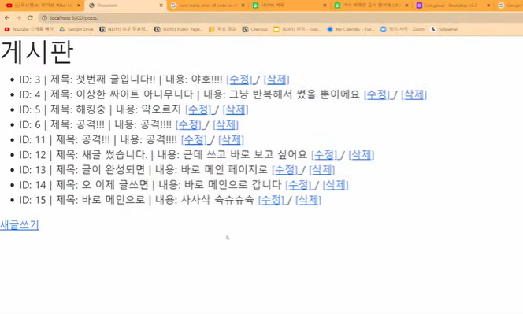

# ✅CRUD 심화 (detail page)

> 이번 파트에서는 detail page 가 있는 게시판을 만들어 봅니다
>
> 1. detail page 필요성
> 2. detail page 만들기
> 3. UPDATE


## 1. detail page 필요성

- 어제는 아래와 같이 CRUD 기능을 구현하면서 글 목록 보여 주는 페이지를 작성했습니다




- 그런데 일반적인 게시판 메인 페이지(`index.html`)을 생각해보면, 글의 제목만 나열되어있고 그 제목을 눌러야만 전체 내용과 수정/삭제 버튼이 있는 페이지로 이동합니다
- 오늘은 이런 detail page 를 만들어 봅니다
  - detail page: 글 제목을 누르면, 내용을 출력해주는 페이지


---


## 2. detail page 만들기

(1) 어제까지 작업하던 프로젝트(`day3pjt`) 폴더를 찾고, 가상환경 activate

(2) 어제 만든 게시판 앱(`posts`) 폴더를 찾고, `posts/templates/posts` 폴더에서 `index.html` 수정

- 내용이 출력되는 detail page 를 별도로 만들어줄거니까, 어제 작성한 코드에서 `내용: {{ post.content }}` 부분을 지움
- 제목 부분을 눌렀을 때 detail page 로 넘어갈 수 있도록 `<a>` 태그로 감싸기
  - `href=""`

```django
<!-- posts/templates/posts/index.html -->




<h1>게시판</h1>

<ul>
    
    <li>ID: {{ post.id }} | 
        <a href="">
            제목: {{ post.title }}</a>
        <a href="">
            [수정]
        </a> / 
        <a href="/posts/delete/{{ post.id }}">
            [삭제]
        </a>
    </li>
    
</ul>

<a href="">새글쓰기</a>


```

(3) `urls.py` 에서 detail 의 path 만들기 

```python
# posts - urls.py

from django.urls import path
from . import views

"""
메인(R) 페이지: 게시글의 목록(/posts/) / 게시글 상세
작성(C) 페이지: 글을 작성하는 페이지 / 작성 완료
수정(U) 페이지: 글을 수정하는 페이지 / 수정 완료
삭제(D) : 글목록이나 상세 페이지에 넣을 기능, 글 삭제 완료
"""

app_name = 'posts'

urlpatterns = [
    path('', views.index, name='index'),
    path('new/', views.new, name='new')
    path('create/', views.create, name='create'),
    path('delete/<int:pk>', views.delete, name='delete'),
    # 요청 - 응답 항상 생각하기
    # 어떤 주소(detail/)로 요청하면
    # 어떤 view 함수(detail)를 응답할까?
    path('detail/', views.detail, name='detail'),
]
```

(4) `views.py` 에서 detail 함수 만들기

```python
from django.shortcuts import render, redirect
from .models import Post

def index(request):
    # 모든 글 목록을 보여준다.
    # 1. DB에서 모든 글을 불러온다.
    posts = Post.objects.all()
    # 2. template 에 보내준다.
    context = {
        'posts' : posts,
    }
    
    return render(request, 'posts/index.html', context)

def detail(request):
    return render(request, 'posts/detail.html')

def new(request):
    return render(request, 'posts/new.html')

def create(request):
    
    # 1. parameter 로 날라온 데이터를 받아서
    title = request.GET.get('title')
    content = request.GET.get('content')
    
    # 2. DB에 저장
    Post.objects.create(title=title, content=content)
    
    context = {
        'title': title,
        'content': content, 
    }
    
    return redirect('posts:index')

def delete(request, pk):
    Post.objects.get(id=pk).delete()
    
    return redirect('posts:index')
```

(5) `posts/templates/posts` 폴더에 `detail.html` 생성

- 더미 데이터로 `<h2>`, `<p>` 부분 작성해두기

```django



<h1>detail.html</h1>
<h2>제목 : 오늘의 점심은?</h2>
<p>골라주세요.</p>


```

(6) python manage.py runserver 하면서 `detail.html` 잘 연결됐는지 확인

(7) `detail.html` 에서 더미 데이터 넣은 부분은, `views.py` 에서 불러온 데이터를 넣어야 정상이기 때문에 비어있던 detail 함수를 아래와 같이 채워주기

- `posts/views.py`

```python
from django.shortcuts import render, redirect
from .models import Post

def index(request):
    # 모든 글 목록을 보여준다.
    # 1. DB에서 모든 글을 불러온다.
    posts = Post.objects.all()
    # 2. template 에 보내준다.
    context = {
        'posts' : posts,
    }
    
    return render(request, 'posts/index.html', context)

def detail(request):
    # get() 메서드를 사용해서 특정 pk의 데이터를 불러온다.
    Post.objects.get(pk = ...)
    
    return render(request, 'posts/detail.html')

def new(request):
    return render(request, 'posts/new.html')

def create(request):
    
    # 1. parameter 로 날라온 데이터를 받아서
    title = request.GET.get('title')
    content = request.GET.get('content')
    
    # 2. DB에 저장
    Post.objects.create(title=title, content=content)
    
    context = {
        'title': title,
        'content': content, 
    }
    
    return redirect('posts:index')

def delete(request, pk):
    Post.objects.get(id=pk).delete()
    
    return redirect('posts:index')
```

(8) `index.html` 에서 [삭제] 버튼 href 경로 수정

- href 경로에 pk 값을 동적 인자로 전달
- `제목: ` 부분을 감싸는 `<a>` 태그 href 경로에도 pk 값을 동적 인자로 전달

```django
<!-- posts/templates/posts/index.html -->




<h1>게시판</h1>

<ul>
    
    <li>ID: {{ post.id }} | 
        <a href="">
            제목: {{ post.title }}</a>
        <a href="">
            [수정]
        </a> / 
        <a href="">
            [삭제]
        </a>
    </li>
    
</ul>

<a href="">새글쓰기</a>


```

(9) `urls.py` 에서도 path 에 동적 인자(pk값)를 명시

- `path('detail/<int:pk>', views.detail, name='detail')`

```python
# posts - urls.py

from django.urls import path
from . import views

"""
메인(R) 페이지: 게시글의 목록(/posts/) / 게시글 상세
작성(C) 페이지: 글을 작성하는 페이지 / 작성 완료
수정(U) 페이지: 글을 수정하는 페이지 / 수정 완료
삭제(D) : 글목록이나 상세 페이지에 넣을 기능, 글 삭제 완료
"""

app_name = 'posts'

urlpatterns = [
    path('', views.index, name='index'),
    path('new/', views.new, name='new')
    path('create/', views.create, name='create'),
    path('delete/<int:pk>', views.delete, name='delete'),
    # 요청 - 응답 항상 생각하기
    # 어떤 주소(detail/)로 요청하면
    # 어떤 view 함수(detail)를 응답할까?
    path('detail/<int:pk_>', views.detail, name='detail'),
]
```

(10) DB 에서 데이터 가져오기

- `index.html` 과 `urls.py` 수정하면서 pk값이 필요한 곳들을 채워 넣었으니, `views.py` 에서 detail 함수 작성 마무리하기
- ⚠️ `urls.py ` 내부 path 에서 정의한 pk값(동적인자) 이름과 `views.py` 내부 함수에서 전달 받는 pk값(동적인자) 이름은 **무조건 동일하게** 맞춰야함

``` python
from django.shortcuts import render, redirect
from .models import Post

def index(request):
    # 모든 글 목록을 보여준다.
    # 1. DB에서 모든 글을 불러온다.
    posts = Post.objects.all()
    # 2. template 에 보내준다.
    context = {
        'posts' : posts,
    }
    
    return render(request, 'posts/index.html', context)

def detail(request, pk_):
    # get() 메서드를 사용해서 특정 pk의 데이터를 불러온다.
    # 불러온 데이터를 변수에 할당
    post = Post.objects.get(pk = pk_)
    
    context = {
        'post': post,
    }
    
    return render(request, 'posts/detail.html', context)

def new(request):
    return render(request, 'posts/new.html')

def create(request):
    
    # 1. parameter 로 날라온 데이터를 받아서
    title = request.GET.get('title')
    content = request.GET.get('content')
    
    # 2. DB에 저장
    Post.objects.create(title=title, content=content)
    
    context = {
        'title': title,
        'content': content, 
    }
    
    return redirect('posts:index')

def delete(request, pk):
    
    Post.objects.get(id=pk).delete()
    
    return redirect('posts:index')
```

(11) detail page 더미 데이터 지우고 값 추가

- (10) 까지의 과정에서 [제목] 을 클릭하면 `detail.html` 로 넘어오도록 구현했기 때문에, 이제는 `detail.html` 의 더미 데이터 대신 실제 입력 데이터를 넘겨줘야함

```django


<h1>detail.html</h1>
<h2>제목 : {{ post.title }}</h2>
<p>{{ post.content }}</p>

```


---


## 3. UPDATE

- 위 작업에서 비워놓았던 [수정] 버튼의 href 를 채워보자
- create 와 read 가 섞인게 UPDATE
- 수정 페이지(edit.html), 그리고 [수정완료] 버튼을 눌렀을 때 변경 사항을 반영한 VIEW 가 필요


(1) edit 에 대한 urls 과 view 만들기

- `index.html` 에서 [수정] 버튼을 감싼 `<a>` 태그에 posts:edit 이라는 url 생성

```django



<h1>게시판</h1>

<ul>
    
    <li>ID: {{ post.id }} | 
        <a href="">
            제목: {{ post.title }}</a>
        <a href="">
            [수정]
        </a> / 
        <a href="">
            [삭제]
        </a>
    </li>
    
</ul>

<a href="">새글쓰기</a>


```

(2) `urls.py` 에서 edit 에 해당하는 path 생성

- `path('edit', views.edit, name='edit'),`

```python
# posts - urls.py

from django.urls import path
from . import views

"""
메인(R) 페이지: 게시글의 목록(/posts/) / 게시글 상세
작성(C) 페이지: 글을 작성하는 페이지 / 작성 완료
수정(U) 페이지: 글을 수정하는 페이지 / 수정 완료
삭제(D) : 글목록이나 상세 페이지에 넣을 기능, 글 삭제 완료
"""

app_name = 'posts'

urlpatterns = [
    path('', views.index, name='index'),
    path('new/', views.new, name='new')
    path('create/', views.create, name='create'),
    path('delete/<int:pk>', views.delete, name='delete'),
    # 요청 - 응답 항상 생각하기
    # 어떤 주소(detail/)로 요청하면
    # 어떤 view 함수(detail)를 응답할까?
    path('detail/<int:pk_>', views.detail, name='detail'),
    path('edit', views.edit, name='edit'),
]
```

(3) path 를 생성했으니, `views.py` 에서 edit 함수 생성

```python
from django.shortcuts import render, redirect
from .models import Post

def index(request):
    # 모든 글 목록을 보여준다.
    # 1. DB에서 모든 글을 불러온다.
    posts = Post.objects.all()
    # 2. template 에 보내준다.
    context = {
        'posts' : posts,
    }
    
    return render(request, 'posts/index.html', context)

def detail(request, pk_):
    # get() 메서드를 사용해서 특정 pk의 데이터를 불러온다.
    # 불러온 데이터를 변수에 할당
    post = Post.objects.get(pk = pk_)
    
    context = {
        'post': post,
    }
    
    return render(request, 'posts/detail.html', context)

def new(request):
    return render(request, 'posts/new.html')

def edit(request):
    return render(request, 'posts/edit.html')

def create(request):
    
    # 1. parameter 로 날라온 데이터를 받아서
    title = request.GET.get('title')
    content = request.GET.get('content')
    
    # 2. DB에 저장
    Post.objects.create(title=title, content=content)
    
    context = {
        'title': title,
        'content': content, 
    }
    
    return redirect('posts:index')

def delete(request, pk):
    
    Post.objects.get(id=pk).delete()
    
    return redirect('posts:index')
```

(4) `posts/templates/posts/` 안에 `edit.html` 생성 

- (꿀팁) 글 생성 페이지였던 `new.html` 긁어오기

```django



<h1>글 수정</h1>
<form action="">
    제목: <input type="text" name="text"><br>
    내용: <input type="text" name="content">
    <input type="submit">
</form>


```

(5) `index.html` 와서 [수정] 부분 `<a>` 태그 href 경로에 `post.pk` 전달

- 글 수정 페이지(`edit.html`)에는 수정하고 싶은 글의 pk값을 동적인자로 넘겨줘야함
  - 기존에 작성한 데이터를 보여주면서 수정하게끔 해야하기 때문

```django



<h1>게시판</h1>

<ul>
    
    <li>ID: {{ post.id }} | 
        <a href="">
            제목: {{ post.title }}</a>
        <a href="">
            [수정]
        </a> / 
        <a href="">
            [삭제]
        </a>
    </li>
    
</ul>

<a href="">새글쓰기</a>


```

(6) `urls.py` 에서 던져진 pk값 받아주기

- `path('edit/<int:pk_>', views.edit, name='edit'),`

```python
# posts - urls.py

from django.urls import path
from . import views

"""
메인(R) 페이지: 게시글의 목록(/posts/) / 게시글 상세
작성(C) 페이지: 글을 작성하는 페이지 / 작성 완료
수정(U) 페이지: 글을 수정하는 페이지 / 수정 완료
삭제(D) : 글목록이나 상세 페이지에 넣을 기능, 글 삭제 완료
"""

app_name = 'posts'

urlpatterns = [
    path('', views.index, name='index'),
    path('new/', views.new, name='new')
    path('create/', views.create, name='create'),
    path('delete/<int:pk>', views.delete, name='delete'),
    # 요청 - 응답 항상 생각하기
    # 어떤 주소(detail/)로 요청하면
    # 어떤 view 함수(detail)를 응답할까?
    path('detail/<int:pk_>', views.detail, name='detail'),
    path('edit/<int:pk_>', views.edit, name='edit'),
]
```

(7) `views.py` edit 함수에 pk 넣기

```python
from django.shortcuts import render, redirect
from .models import Post

def index(request):
    # 모든 글 목록을 보여준다.
    # 1. DB에서 모든 글을 불러온다.
    posts = Post.objects.all()
    # 2. template 에 보내준다.
    context = {
        'posts' : posts,
    }
    
    return render(request, 'posts/index.html', context)

def detail(request, pk_):
    # get() 메서드를 사용해서 특정 pk의 데이터를 불러온다.
    # 불러온 데이터를 변수에 할당
    post = Post.objects.get(pk = pk_)
    
    context = {
        'post': post,
    }
    
    return render(request, 'posts/detail.html', context)

def new(request):
    return render(request, 'posts/new.html')

def edit(request, pk_):
    # get() 메서드를 사용해서 특정 pk 데이터를 불러온다.
    # 값을 context 변수에 넣어서 템플릿에서 출력
    post = Post.objects.get(pk = pk_)
    context = {
        "post" : post,
    }
    
    return render(request, 'posts/edit.html', context)

def create(request):
    
    # 1. parameter 로 날라온 데이터를 받아서
    title = request.GET.get('title')
    content = request.GET.get('content')
    
    # 2. DB에 저장
    Post.objects.create(title=title, content=content)
    
    context = {
        'title': title,
        'content': content, 
    }
    
    return redirect('posts:index')

def delete(request, pk):
    
    Post.objects.get(id=pk).delete()
    
    return redirect('posts:index')
```

(8) `edit.html` 수정하기

- `<input>` 태그에 pk 활용해 받은 데이터 넣으려면 `value=` 이용하면 됨

```django



<h1>글 수정</h1>
<form action="">
    제목: <input type="text" name="text" value="{{ post.title }}"><br>
    내용: <input type="text" name="content" value="{{ post.content }}">
    <input type="submit">
</form>


```

(9) 여기까지 구현하고 서버 돌려보면, 글 수정 페이지에 이전에 작성했던 제목과 내용이 그대로 넘어온 것을 확인할 수 있음

- 확인 주소 : localhost:8000/posts/edit/[글pk번호]

(10) UPDATE 작업

- `<form action="">` 부분을 아래와 같이 바꿈

```django



<h1>글 수정</h1>
<!-- 특정 pk를 가진 데이터를 불러오기 위해 pk를 동적인자로 전달 -->
<form action="">
    제목: <input type="text" name="text" value="{{ post.title }}"><br>
    내용: <input type="text" name="content" value="{{ post.content }}">
    <input type="submit">
</form>


```

(11) `urls.py` 에서 새로 만든 update 의 path 추가하기

- update 주소를 요청하면 update 함수를 응답하는 것
- `path('update/<int:pk_>', views.update, name='update'),`

```python
# posts - urls.py

from django.urls import path
from . import views

"""
메인(R) 페이지: 게시글의 목록(/posts/) / 게시글 상세
작성(C) 페이지: 글을 작성하는 페이지 / 작성 완료
수정(U) 페이지: 글을 수정하는 페이지 / 수정 완료
삭제(D) : 글목록이나 상세 페이지에 넣을 기능, 글 삭제 완료
"""

app_name = 'posts'

urlpatterns = [
    path('', views.index, name='index'),
    path('new/', views.new, name='new')
    path('create/', views.create, name='create'),
    path('delete/<int:pk>', views.delete, name='delete'),
    # 요청 - 응답 항상 생각하기
    # 어떤 주소(detail/)로 요청하면
    # 어떤 view 함수(detail)를 응답할까?
    path('detail/<int:pk_>', views.detail, name='detail'),
    path('edit/<int:pk_>', views.edit, name='edit'),
    path('update/<int:pk_>', views.update, name='update'),
]

```

(12) `views.py` 에 update 함수 만들기

- create 함수 아래 부분 참조

```python
from django.shortcuts import render, redirect
from .models import Post

def index(request):
    # 모든 글 목록을 보여준다.
    # 1. DB에서 모든 글을 불러온다.
    posts = Post.objects.all()
    # 2. template 에 보내준다.
    context = {
        'posts' : posts,
    }
    
    return render(request, 'posts/index.html', context)

def detail(request, pk_):
    # get() 메서드를 사용해서 특정 pk의 데이터를 불러온다.
    # 불러온 데이터를 변수에 할당
    post = Post.objects.get(pk = pk_)
    
    context = {
        'post': post,
    }
    
    return render(request, 'posts/detail.html', context)

def new(request):
    return render(request, 'posts/new.html')

def edit(request, pk_):
    # get() 메서드를 사용해서 특정 pk 데이터를 불러온다.
    # 값을 context 변수에 넣어서 템플릿에서 출력
    post = Post.objects.get(pk = pk_)
    context = {
        "post" : post,
    }
    
    return render(request, 'posts/edit.html', context)

def create(request):
    
    # 1. parameter 로 날라온 데이터를 받아서
    title = request.GET.get('title')
    content = request.GET.get('content')
    
    # 2. DB에 저장
    Post.objects.create(title=title, content=content)
    
    context = {
        'title': title,
        'content': content, 
    }
    
    return redirect('posts:index')

def update(request, pk_):
    # 수정할 특정한 데이터를 불러와서 변수에 할당 -> pk_ 를 사용해서
    post = Post.objects.get(pk = pk_)
    
    # create 처럼, 파라미터로 날아온 데이터를 변수에 받아야함
    title_ = request.GET.get('title')
    content_ = request.GET.get('content')
    
    # 데이터를 수정
    post.title = title_
    post.content = content_
    
    # 수정한 데이터를 반영(save)
    post.save()
    
    # 데이터를 detail 페이지로 리다이렉트
    # post.pk 부분에 pk_ 로 써도 됨
    return redirect('posts:detail', post.pk)

def delete(request, pk):
    
    Post.objects.get(id=pk).delete()
    
    return redirect('posts:index')
```

