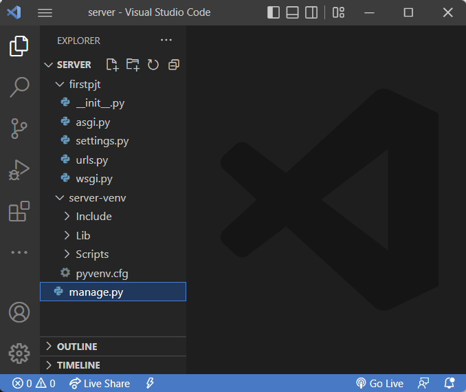

# ✅ Django 시작하기

> 1. Web 이해하기
> 2. 클라이언트와 서버
> 3. Web browser, Web page
> 4. Django 구조 이해하기(MTV Design Pattern)
> 5. Django 개발 환경 설정 가이드
> 6. Project & Application
>
> 
>
> 💡 웹 학습 추천 영상 [(link)](https://www.youtube.com/watch?v=PUPDGbnpSjw)


---


- 지금까지 우리는 ...
  - Python 도 익숙해졌고, HTML, CSS도 배워서 웹 페이지도 구성할 수 있는 상태, 하지만 '웹 서비스 하나 만들어줄 수 있어?' 라고 묻는다면?
  - '웹 서비스 개발'에는 무엇이 필요할까?
    - 로그인, 로그아웃, 회원관리, 데이터베이스, 서버, 클라이언트, 보안 등
    - 너무 많은 기술들이 필요 → 이걸 어떻게 다 만들어야 할까?
    - 모든 걸 직접 만들 필요 없음
    - 잘 만들어진 것들을 가져다가 좋은 환경에서 잘 쓰기만 하면 되는 세상
      - "거인의 어깨 위에서 프로그래밍 하기"


- **Framework** 이해하기
  - 누군가 만들어 놓은 코드를 재사용하는 것은 이미 익숙한 개발 문화
  - 그렇다면 '웹 서비스'도 누군가 개발해 놓은 코드를 재사용하면 된다!
  - 전 세계 수많은 개발자들이 이미 수없이 많이 개발해 봤고, 그 과정에서 자주 사용되는 부분들을 재사용 할 수 있게 좋은 구조의 코드로 만들어 두었음
  
  - 그러한 코드들을 모아 놓은 것, 즉 서비스 개발에 필요한 기능들을 미리 구현해서 모아 놓은 것 = 프레임워크(Framework)
  
  - Frame(뼈대, 틀) + Work(일하다)
    - 일정한 뼈대, 틀을 가지고 일하다
    - 제공받은 도구들과 뼈대, 규약을 가지고 무언가를 만드는 일
    - 특정 프로그램을 개발하기 위한 여러 도구들과 규약을 제공하는 것
  
  - "소프트웨어 프레임워크"는 복잡한 문제를 해결하거나 서술하는 데 사용되는 기본 개념 구조
  - 따라서, Framework를 잘 사용하기만 하면 웹 서비스 개발에 있어서 모든 것들을 하나부터 열까지 직접 개발할 필요 없이, 내가 만들고자 하는 본질(로직)에 집중해 개발할 수 있음
  - 소프트웨어 생산의 품질을 높임


- 여러가지 Web Framework
  - 웹 서비스를 만들 수 있는 다양한 프레임워크
  - 2020년 Github Star 수 기준 인기 프레임워크 순위
  
    


- Django를 배워야하는 이유

  - Python으로 작성된 프레임워크
    - Python 이라는 언어의 강력함과 거대한 커뮤니티

  - 수많은 여러 유용한 기능들

  - 검증된 웹 프레임워크
    - 화해, Toss, 두나무, 당근마켓, 요기요 등
    - 유명하고 많은 서비스들이 사용한다는 것 == 안정적으로 서비스를 할 수 있다는 검증


---


## 1. Web 이해하기

>  Django가 Web 서비스를 만드는 프레임워크기 때문에, Web 이 뭔지 다시 한번 복습!


- WWW (World Wide Web)
  - 인터넷이란? (inter + net, 서로 연결)
    - 우리가 구글에 접속할 때
      - 웹 브라우저를 켠다
      - 주소창에 주소를 입력한다 (www.google.com)
    - www, 즉 World Wide Web은 '전 세계에 퍼져 있는 거미줄 같은 연결망'


- IP 와 도메인 [(link)](https://developer.mozilla.org/ko/docs/Learn/Common_questions/How_does_the_Internet_work#%EB%8B%A4%EC%9D%8C_%EB%8B%A8%EA%B3%84)
  - IP
    - 컴퓨터에 메세지를 보내려면 메세지를 받을 특정 컴퓨터를 지정해야 함
    - 따라서 네트워크에 연결된 모든 컴퓨터는 **IP(Internet Protocal)주소**라는 고유한 주소가 있음
    - IP 주소는 점으로 구분된 4개의 숫자로 구성 (ex. 192.168.2.10.)
  - 도메인
    - 컴퓨터는 IP 주소를 기억하는데 문제가 없지만, 사람의 기억력으로는 힘듬
    - 따라서 사람이 읽을 수 있는 **도메인 이름**을 각 IP주소의 이름으로 지정
    - ex) 173.194.121.32(IP주소), google.com(도메인 이름)


- 연결 되어 있는 세계
  - 우리가 구글 홈페이지에 접속할 수 있는 이유는, 구글 본사 컴퓨터와 우리의 컴퓨터 간의 통신이 연결 되어 있기 때문
  - 전 세계는 아주 두껍고 튼튼한 해저케이블로 연결 되어있음
  - 해양 생물로 인해 문제가 생긴다면 인터넷이 잠시 느려지거나, 마비가 될 수 있음
  - 이렇게 전 세계는 촘촘하고 거대한 유선으로 연결 되어있고, 이러한 연결로부터 시작해 아주 많은 전봇대를 거쳐 우리집으로 인터넷이 연결됨
  - 하지만 이런 유선 연결은 한계가 있음
    - 히말라야 정상이나, 아마존 밀림까지 케이블을 까는 것은 매우 어려운 일
    - 오지가 아니어도 개발 도상국에서는 충분한 인프라를 기대하기 어려움
    - "정보의 빈곤"


- 전 세계를 무선으로 연결하기
  - "스타링크 프로젝트" - Space X
    - 지구를 아주 많은 소형 위성으로 감싸서, 케이블이 아닌 위성끼리 데이터를 교환
  - "스타링크 프로젝트"의 문제점
    - Starlink Train: 천체 사진 찍을 때 노출을 길게 주기 때문에, 스타링크의 소형 위성들이 주변에 있으면 천체 사진 망침
    - 우주 쓰레기
    - 상용화 되기엔 아직 속도가 느림(2G 대용으로 사막에서 사용하는 정도)


- 정리
  - 결국 우리가 인터넷을 이용한다는 건, 전 세계의 컴퓨터가 연결되어 있는 하나의 인프라를 이용한다는 것


---


## 2. 클라이언트와 서버

> 웹 서비스는 웹을 통해서 만들어지는 서비스(= 요청-응답 매칭으로 무형의 편의성을 제공)
>
> 요청은 클라이언트가 하는 일 / 응답은 서버(service provider)가 하는 일
>
> 
>
> 🗂️ [(참고서1)](https://developer.mozilla.org/ko/docs/Learn/Getting_started_with_the_web/How_the_Web_works) [(참고서2)](https://developer.mozilla.org/ko/docs/Learn/Common_questions/What_is_a_web_server)


- 클라이언트-서버 구조
  - 오늘날 우리가 사용하는 대부분의 웹 서비스는 클라이언트-서버 구조를 기반으로 동작
  - 클라이언트와 서버 역시 하나의 **컴퓨터**이며 이들이 어떻게 상호작용하는지에 대한 간소화된 다이어그램은 다음과 같음(pdf 참조)
  
  - 클라이언트
    - 웹 사용자의 인터넷에 연결된 장치 (예를 들어 wi-fi에 연결된 컴퓨터 또는 모바일)
    - Chrome 또는 Firefox 와 같은 웹 브라우저
    - 서비스를 요청하는 주체
  
  - 서버
    - 웹 페이지, 사이트 또는 앱을 저장하는 컴퓨터
    - 클라이언트가 웹 페이지에 접근하려고 할 때 서버에서 클라이언트 컴퓨터로 웹 페이지 데이터를 응답해 사용자의 웹 브라우저에 표시됨
    - 요청에 대해 서비스를 응답하는 주체
  - 상호작용 예시
    - 예를 들어, 우리가 Google 홈페이지에 접속한다는 것은 무엇을 뜻하는지 알아보자
    - 결론적으로 인터넷에 연결된 전 세계 어딘가에 있는 구글 컴퓨터에게 'Google 홈페이지.html' 파일을 달라고 요청하는 것
    - 그러면 구글 컴퓨터는 우리의 요청을 받고 'Google 홈페이지.html' 파일을 인터넷을 통해서 우리 컴퓨터에게 응답해줌
    - 그렇게 전달받은 Google 홈페이지.html 파일을 우리가 볼 수 있도록 웹 브라우저가 해석해 주는 것
  - 여기서 'Google 홈페이지.html' 을 달라고 요청한 컴퓨터, 웹 브라우저를 클라이언트라고 하고, 'Google 홈페이지.html' 파일을 제공한 컴퓨터, 프로그램을 서버라고 함
  - 어떠한 자원(resource)을 달라고 요청(request)하는 쪽을 클라이언트라고 하고 자원을 제공해주는 쪽을 서버(server)라고 함


- 정리
  - 우리가 사용하는 웹은 클라이언트-서버 구조로 이루어져 있음
  - 앞으로 우리가 배우는 것도 이 클라이언트-서버 구조를 만드는 방법을 배우는 것
  - 이 중에서 Django 는 서버를 구현하는 웹 프레임워크


- 서비스 요청이란?

  - 누구에게 = www.naver.com:00 에게 [도메인]
    - '00' 은 포트번호
  - 무엇을 = 어떤 페이지(주소 or 주문서)를 [/에 해당하는 부분]
    - 컴퓨터에서 '/' 는 루트 경로(=상위 경로)

  ```bash
  웹 브라우저 주소창에 223.130.220.104 (=IP주소)로 검색해도 네이버가 열림
  223.130.220.104:80 해도 열림(80은 포트번호)
  223.130.220.104:80/789 하면 새로운 창이 열림
  ```

  - 인터넷 주소 이해하기
  
    
  
    - www.google.com: 커피숍
    - 80: 서버분 번호
    - http: 말로 주문할래? 앱으로 주문할래?
      - http(hypertext transfer protocol, 하이퍼텍스트 전송 규약)은 클라이언트와 서버가 서로 통신할 수 있도록 언어를 정의
      - http 관련 참고서 → [(link)](https://developer.mozilla.org/ko/docs/Web/HTTP/Overview)
  - 결국 웹 서비스는 위 이미지(=주소창) 같은 주문서를 만드는 것과 같음


---


## 3. Web browser, Web page

- 웹 브라우저란?
  - 웹에서 페이지를 찾아 보여주고, 사용자가 하이퍼링크를 통해 다른 페이지로 이동할 수 있도록 하는 프로그램
  - 웹 페이지 파일을 우리가 보는 화면으로 바꿔주는 (렌더링, rendering) 프로그램


- 웹 브라우저 예시
  - 우리가 보고 있는 웹 페이지는 사실 HTML 문서 파일 하나
  - google 홈페이지를 예로 들면 우리는 구글 로고가 있는 예쁜 화면을 보지만, 사실 빼곡한 코드로 작성된 HTML 문서를 서버로부터 전달받게 됨
  - 즉, 웹 페이지 코드를 받으면 우리가 보는 화면처럼 바꿔주는 것이 바로 웹 브라우저


- 웹 페이지란?
  - 웹에 있는 문서
    - 우리가 보는 화면 각각 한 장 한 장이 웹 페이지
  - 웹 페이지 종류
    - 정적 웹 페이지
    - 동적 웹 페이지


- 정적 웹 페이지
  - Static Web page
  - 있는 그대로를 제공하는 것(served as-is)을 의미
  - ex) 회사 소개 페이지처럼 로그인이 필요 없는 웹 페이지
  - 우리가 지금까지 작성한 웹 페이지이며 한 번 작성된 HTML 파일의 내용이 변하지 않고 모든 사용자에게 동일한 모습으로 전달되는 것
    - == 서버에 미리 저장된 HTML 파일 그대로 전달된 웹 페이지
    - == 같은 상황에서 모든 사용자에게 동일한 정보를 표시


- 동적 웹 페이지
  - Dynamic Web page
  - 사용자의 요청에 따라 웹 페이지에 추가적인 수정이 되어 클라이언트에게 전달되는 웹 페이지
  - ex) 주문이 되는 요즘 서비스는 대부분 동적 웹 페이지
  - 웹 페이지의 내용을 바꿔주는 주체 == 서버
    - 서버에서 동작하고 있는 프로그램이 웹 페이지를 변경해줌
    - 이렇게 사용자의 요청을 받아서 적절한 응답을 만들어주는 프로그램을 쉽게 만들 수 있게 도와주는 프레임워크가 바로 우리가 배울 Django
  - 다양한 서버 사이드 프로그래밍 언어(python, java, c++ 등) 사용 가능 파일을 처리하고 데이터베이스와의 상호작용이 이루어짐
  - 이 중에서 Python을 이용해서 개발할 수 있는 프레임워크인 Django를 학습하는 것


---


## 4. Django 구조 이해하기(MTV Design Pattern)


---


## 5. Django 개발 환경 설정 가이드

- 가상환경 설정 및 활성화(실행)부터 Django 설치까지

  1. Git Bash 열기

     

  2. 작업하고 있는 경로 확인 (`pwd` 로 확인해보면 ~ 는 `/c/Users/[사용자이름]` 의미)

     

  3. 프로젝트 이름(ex. server)을 참고해서 작업할 폴더 생성

     

  4. 프로젝트 폴더 안에 가상환경 생성

     - `python -m venv [가상환경 이름] ` 
     - 가상환경 이름은 마음대로 작성해도 됨(`프로젝트이름-venv` 으로 이름짓기 추천)
     - 이렇게 가상환경(`server-venv`)을 만들고 프로젝트를 시작해야 이런저런 패키지를 설치해도 글로벌 영역이 망가지지 않음

     

  5. 가상환경 활성화(실행) 및 비활성화

     - (참고) 폴더명/파일명 대충 몇글자만 쓰다가 tab 누르면 나머지 이름 자동완성

     

  6. (가상환경 안에) Django (version 3.2.13) - LTS 설치

     - ⚠️ Django 설치 전, pip 버전 확인하고 업그레이드 하기!
  
       ```bash
       $ pip --version
       $ python -m pip install --upgrade pip
       ```
     - ⚠️`pip install django` 만 하면 가장 최신 버전(4.XX) 설치되니까 주의
     - 회사에서도 안정성 이슈 때문에 가장 최신 버전은 아마 안 쓸 것
     - (참고) LTS (Long Term Support, 장기 지원 버전)
       - 일반적인 경우보다 장기간에 걸쳐 지원하도록 고안된 소프트웨어 버전
       - 컴퓨터 소프트웨어의 제품 수명주기 관리 정책
       - 배포자는 LTS 확정을 통해 장기적이고 안정적인 지원을 보장

     

  7. django-admin 에게 프로젝트 셋업(생성) 해달라고 명령

     - `django-admin startproject [프로젝트 이름] [시작경로(현재폴더)] `

     

     

  8. 서버 돌리기
  
     
  
  9. (로컬 컴퓨터 내부에서) 서버 잘 돌아가고 있는지 확인
  
     - 브라우저 주소창에 `localhost:8000` 입력
       - `localhost` : 우리 주소, 커피숍(비유)
       - `8000` : 키오스크 혹은 직원 번호(비유)
     - 아래와 같이 django 가 기본적으로 준비한 페이지가 뜬다면 서버 작동이 정상적으로 확인된 것
  
     
  
  10. 가상환경을 삭제하고 싶다면?
  
      - 가상환경 만들어진 폴더를 삭제하거나
      - Git Bash 창에 `rm -r [가상환경 이름]/`
        - ex. `rm -r server-venv/`


---


## 6. Project & Application

> 5. Django 개발 환경 설정 가이드에서 생성된 폴더와 파일을 살펴보는 파트
>
> 
>
> 가상환경과 서버를 실행한 다음, Django 메인 페이지가 뜨는 것이 확인되었으면 아래와 같은 코드로 애플리케이션(앱) 생성

```bash
$ python manage.py startapp 앱이름('복수형'으로 작성 권장)
```

```bash
⚠️주의⚠️

위 코드를 Git Bash/VScode-Terminal 창에 입력해서 
앱을 생성했다면, 반드시 해당 앱을 사용하겠다고 
settings.py 파일에 등록해야 함

# settings.py
--(중간 쯤)--
INSTALLED_APPS = []

위와 같은 형식으로 settings.py 파일이 
저장되어 있을텐데, 괄호 내부 맨 윗줄에 '앱이름', 
이렇게 적어주면 Django 서버 구동할 때 
새로 생성한 앱을 알아서 사용할 수 있게 도움

재밌는 점은 괄호('[]')로 작성된 
INSTALLED_APPS 리스트 내부 맨 마지막 요소에도 
쉼표(',')가 있다는 사실인데, 이렇게 element+comma 세트로 
작성하는 것을 trailing commas 컨벤션이라고 함
```

```python
Q) settings.py 에서 
INSTALLED_APPS = [] 리스트 맨 윗줄에
추가하고 싶은 앱이름을 써주는 이유는?
A) 추후 advanced 한 내용에 대비하기 위해
아래의 작성 순서를 지켜주는 것이 좋음

INSTALLED_APPS = [
	# Local apps
	‘articles(새로만든 앱이름 예시)',
    
	# Third party apps
	'haystack',
    
	# Django apps
	'django.contrib.admin',
	'django.contrib.auth',
	'django.contrib.contenttypes',
	'django.contrib.sessions',
	'django.contrib.sites',
]
```

```python
Q) 만약 앱을 지우고 싶다면?
A) 앱 생성부터 사용 등록까지 이어진 위 과정을 반대로 진행

즉, 프로젝트 폴더 내 settings.py 파일에서
INSTALLED_APPS = [] 괄호 내 앱이름을 삭제하고,
작업하던 VScode 에서 앱이름으로 생성되어 있는
폴더 자체를 delete 하면 됨
```


- Project & Application
  - Project
    - "collection of apps"
    - 프로젝트는 앱의 집합
    - 프로젝트에는 여러 앱이 포함될 수 있음
    - 앱은 여러 프로젝트에 있을 수 있음
    - 즉, 프로젝트란 **폴더 단위로 관리되는 파일들의 묶음**
  - Application
    - 앱은 실제 요청을 처리하고 페이지를 보여주는 등의 역할을 담당
    - 일반적으로 앱은 하나의 역할 및 기능 단위로 작성하는 것을 권장
    - 즉, 어플리케이션이란 **프로젝트 폴더 아래에 계속 만들어 나가는 것(=기능들의 묶음)**


- Project 폴더의 구조

  - `__init__.py`

    - Python 에게 이 디렉토리를 하나의 Python 패키지로 다루도록 지시
    - 별도로 추가 코드를 작성하지 않음(=건드리지 말자)

  - `asgi.py`

    - Asynchronous Server Gateway Interface
    - Django 애플리케이션이 비동기식 웹 서버와 연결 및 소통하는 것을 도움
    - 추후 배포 시에 사용하며 지금은 수정하지 않음(=건드리지 말자)

  - `wsgi.py`

    - Web Server Gateway Interface
    - Django 애플리케이션이 웹 서버와 연결 및 소통하는 것을 도움
    - 추후 배포 시에 사용하며 지금은 수정하지 않음(=건드리지 말자)

  - `settings.py` ⭐⭐⭐

    - Django 프로젝트 설정을 관리

  - `urls.py` ⭐⭐⭐

    - 사이트의 url 과 적절한 views의 연결을 지정
    - 입구, 주문서 역할이라서 앞으로 자주 조작하게 될 것
    - (꿀팁) `urls.py` 에서 `ctrl` 누르면서 `views.` 이후에 작성된 함수 이름을 클릭하면 해당 함수가 정의되어 있는 `views.py` 로 이동

  - `manage.py` ⭐⭐⭐

    - Django 프로젝트와 다양한 방법으로 상호작용하는 커맨드라인 유틸리티

    ```bash
    # manage.py 활용 예시
    $ python manage.py <command> [options]
    ```

    

- Application 폴더의 구조
  - `admin.py`
    - 관리자용 페이지를 설정하는 곳
    - 관리자 관련 기능을 넣는 곳이라고 보면 됨
  - `apps.py`
    - 앱의 정보가 작성된 곳
    - 별도로 추가 코드를 작성하지 않음
  - `models.py`
    - 애플리케이션에서 사용하는 Model을 정의하는 곳
    - MTV 패턴의 M에 해당
  - `test.py`
    - 프로젝트 테스트 코드를 작성하는 곳
  - `views.py` ⭐⭐⭐
    - view 함수들이 정의되는 곳
    - MTV 패턴의 V에 해당
