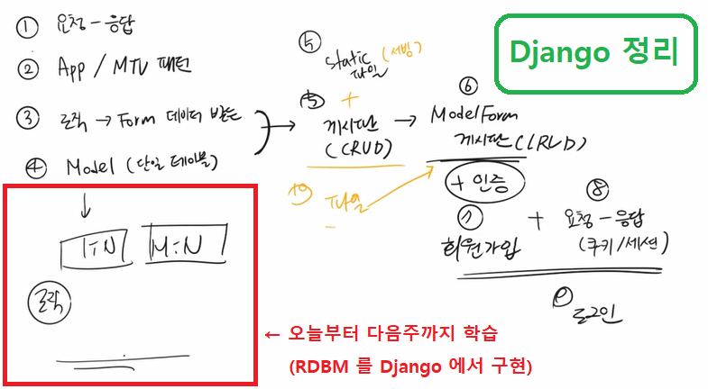
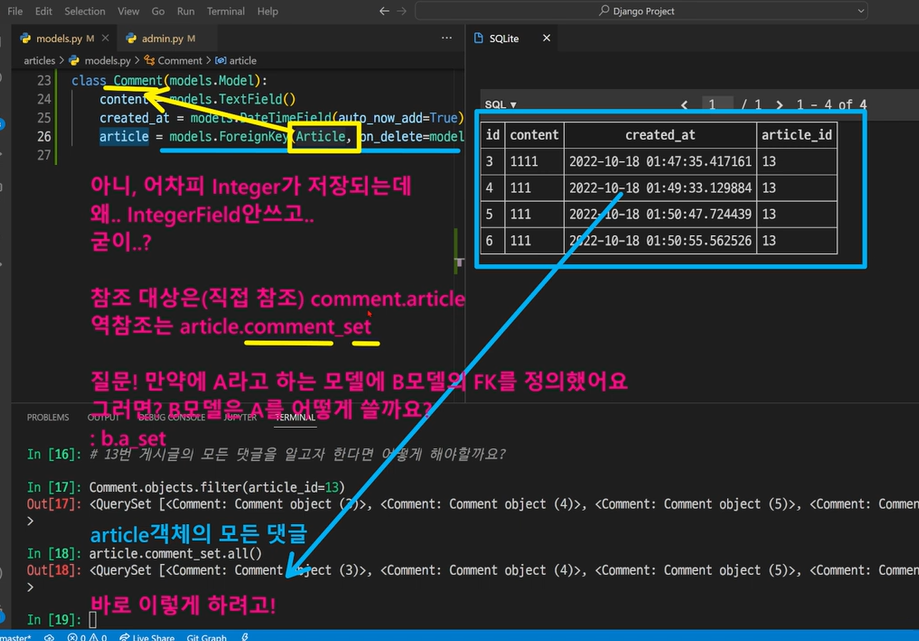

# ✅1:N (Article - Comment)

> 🗂️ [실습] Comment 구현
>
> 1. Intro
>2. 1:N (Article - Comment)





- 이전까지 우리는 ..
  - 이전까지는 기본적인 CRUD 기능을 구현했습니다.
  - 오늘부터 다음주까지는 데이터 모델링을 적용한 CRUD 기능을 구현합니다.
  - python 과 JS 모두 객체가 존재하지만, python 이 지향하는 객체와 JS가 지향하는 객체가 조금씩 다릅니다.
  - 언어에 따라서 공유하고 있는 개념은 있지만, 이걸 실제로 구현하는 모습은 조금씩 다른데, 앞으로 2주 간의 수업에서는 관계형데이터베이스(RDBMS)를 Django 에서 구현하는 것을 배웁니다.


---


## 🗂️ [실습] Comment 구현

> 게시글과 댓글이 1 : N 관계로 매핑 된 게시글에 댓글을 작성할 수 있는 서비스를 개발합니다.
>
> [선행작업]
>
> 1. [필수] 프로젝트 사전 설정 [(link)](https://github.com/code-sum/TIL/blob/master/notes/dj_modelform2.md)
> 2. accounts app & User model 생성 [(link)](https://github.com/code-sum/TIL/blob/master/notes/dj_auth.md)
> 3. 회원관리 서비스 만들기 [(link)](https://github.com/code-sum/CRUD-Practice-5)
> 4. [필수] 게시판 서비스 만들기 [(link)](https://github.com/code-sum/TIL/blob/master/notes/dj_modelform2.md)
> 5. 이미지 관리 기능 추가 [(link)](https://github.com/code-sum/TIL/blob/master/notes/dj_image.md)


- 2022-10-18 추가 구현 기능 (날짜 표시 형식 바꾸기) 👉 [(link)](https://parkhyeonchae.github.io/2020/05/09/django-project-28/)

 

### 1. Comment 모델 생성

```python
# articles/models.py

class Comment(models.Model):
    content = models.TextField()
    created_at = models.DateTimeField(auto_now_add=True)
    article = models.ForeignKey(Article, on_delete=models.CASCADE)
```

```bash
# DB 반영 (가상환경 켰는지 확인 필수)

$ python manage.py makemigrations
$ python manage.py migrate

# DB에 articles_comment 생성되었는지 확인
```

```python
# articles/admin.py

'''
댓글을 관리자 페이지에서 확인하거나
개별적으로 생성, 삭제 가능하도록 등록하고 커스텀
'''

from django.contrib import admin
from .models import Article, Comment

class ArticleAdmin(admin.ModelAdmin):
    list_display = ('title', 'created_at', 'updated_at')

class CommentAdmin(admin.ModelAdmin):
    list_display  = ('content', 'created_at', 'article')

admin.site.register(Article, ArticleAdmin)
admin.site.register(Comment, CommentAdmin)
```

### 2. [READ] 관계 모델 참조

#### 2-1. 역참조 원리 이해

> X번 게시글에 작성된 모든 댓글을 조회하려면, 외래키를 이용해서 X번 게시글을 참조하고 있는 댓글들을 쿼리셋으로 묶어서 모두 받아와야 함
>
> 이걸 가능하게 만들어주는 코드가 `b.a_set.all` (로직은 교재 & 하단 이미지 참조)



#### 2-2. `detail.html` 에 댓글 목록 출력

```python
# articles/views.py

def detail(request, pk):
    article = Article.objects.get(pk=pk)
    context = {
        'article': article,
        # 추가된 코드 👇👇
        'comments': article.comment_set.all(),
    }
    return render(request, 'articles/detail.html', context)
```

```html
<!-- articles/templates/articles/detail.html -->

<!-- Comments -->
  <hr class="my-5">
  
    <p>{{ comment.content }}</p>
    <hr>
    
    <p>안녕하십니까? 댓글이 없는 곳에 번개처럼 나타나는 무플방지위원회입니다.
      <br>
      -무플방지위원회일동-
      <br>
      &nbsp;（｡･ω･｡)つ━☆・*。<br>
      ⊂ &nbsp;&nbsp;&nbsp;&nbsp;&nbsp;&nbsp;ノ ・゜+.<br>
      &nbsp;&nbsp;しー&nbsp;Ｊ °。+ *</p>
  
```
​	💡반복문 안에 생성된 댓글이 없는 경우, 위와 같이 `` 코드를 활용하자

### 3. [CREATE] 댓글 작성

> 사용자에게 form 을 제공해 주는 곳이 게시글 상세 페이지(detail.html)니까, detail 함수에서 comment form 을 넘겨주고 새로운 url & 함수 생성해서 댓글이 저장되는 로직 구현

#### 3-1. 모델 폼 상속받아서 `CommentForm` 생성

```python
# articles/forms.py

from django import forms
from .models import Article, Comment

class ArticleForm(forms.ModelForm):
    class Meta:
        model = Article
        fields = '__all__'
        labels = {
            'title': '제목',
            'content' : '내용',
            'image' : '이미지',
    }

class CommentForm(forms.ModelForm):
    class Meta:
        model = Comment 
        fields = ['content']
```

#### 3-2. views.py 에서 detail 함수에 comment_form 넘겨주기

```python
# articles/views.py

from .forms import ArticleForm, CommentForm

def detail(request, pk):
    article = Article.objects.get(pk=pk)
    comment_form = CommentForm()
    context = {
        'article': article,
        'comments': article.comment_set.all(),
        'comment_form': comment_form,
    }
    return render(request, 'articles/detail.html', context)
```

#### 3-3. 템플릿에 반영

```html
<!-- articles/templates/articles/detail.html -->



<!-- Comments -->
<hr class="my-5">
<form action="" method="POST">
  
  
  
</form>
<hr>

  <p>{{ comment.content }}</p>
  <hr>
      
      <div>
        <p>안녕하십니까? 댓글이 없는 곳에 번개처럼 나타나는 무플방지위원회입니다.
          <br>
          -무플방지위원회일동-
          <br>
          &nbsp;（｡･ω･｡)つ━☆・*。<br>
          ⊂ &nbsp;&nbsp;&nbsp;&nbsp;&nbsp;&nbsp;ノ ・゜+.<br>
          &nbsp;&nbsp;しー&nbsp;Ｊ °。+ *</p>
      </div>

```

#### 3-4. 댓글이 저장되는 로직

```python
# articles/urls.py

urlpatterns = [
    ...,
    path('<int:pk>/comments/', views.comment_create, name='comment_create'),
]
```

```python
# articles/views.py

def comment_create(request, pk):
    article = Article.objects.get(pk=pk)
    comment_form = CommentForm(request.POST)
    if comment_form.is_valid():
        comment = comment_form.save(commit=False)
        comment.article = article
        comment.save()
    return redirect('articles:detail', article.pk)
    
```

#### 3-5. `CommentForm()` 커스텀하기

> 🗂️ [(참고자료)](https://hoik92.github.io/django/2019/06/10/Make-Form-Using-Bootstrap-in-Django.html)

```python
# articles/forms.py

class CommentForm(forms.ModelForm):
    content = forms.CharField(
        label="",
        widget=forms.TextInput(attrs={
            "placeholder": "여러분의 댓글을 기다리고 있어요!",
        })
    )
    class Meta:
        model = Comment 
        fields = ['content']
```

#### 3-6. 댓글 입력 버튼을 form 오른쪽에 붙이기

```django
<!-- Comments -->
<hr class="my-5">
<form action="" method="POST">
  
  
  <div class="d-flex justify-content-end">
    
  </div>
</form>
```

### 4. [DELETE] 댓글 삭제

```python
# articles/urls.py

urlpatterns = [
    ...,
    path('<int:article_pk>/comments/<int:comment_pk>/delete/', views.comments_delete, name='comments_delete'),
]
```

```python
# articles/views.py

from .models import Article, Comment

def comments_delete(request, article_pk, comment_pk):
    comment = Comment.objects.get(pk=comment_pk)
    comment.delete()
    return redirect('articles:detail', article_pk)
```

```html
<!-- articles/templates/articles/detail.html -->


   <div class="d-flex">
     <div class="d-flex align-items-center">
       {{ comment.content }}
     </div>
     <form action="" method="POST">
       
       <button type="submit" class="btn btn-outline-danger ms-2">
         <svg xmlns="http://www.w3.org/2000/svg" width="16" height="16" fill="currentColor" class="bi bi-trash" viewbox="0 0 16 16">
           <path d="M5.5 5.5A.5.5 0 0 1 6 6v6a.5.5 0 0 1-1 0V6a.5.5 0 0 1 .5-.5zm2.5 0a.5.5 0 0 1 .5.5v6a.5.5 0 0 1-1 0V6a.5.5 0 0 1 .5-.5zm3 .5a.5.5 0 0 0-1 0v6a.5.5 0 0 0 1 0V6z"/>
           <path fill-rule="evenodd" d="M14.5 3a1 1 0 0 1-1 1H13v9a2 2 0 0 1-2 2H5a2 2 0 0 1-2-2V4h-.5a1 1 0 0 1-1-1V2a1 1 0 0 1 1-1H6a1 1 0 0 1 1-1h2a1 1 0 0 1 1 1h3.5a1 1 0 0 1 1 1v1zM4.118 4 4 4.059V13a1 1 0 0 0 1 1h6a1 1 0 0 0 1-1V4.059L11.882 4H4.118zM2.5 3V2h11v1h-11z"/>
         </svg>
       </button>
     </form>
   </div>
   <hr>
   
   <div>
     <p>안녕하십니까? 댓글이 없는 곳에 번개처럼 나타나는 무플방지위원회입니다.
       <br>
       -무플방지위원회일동-
       <br>
       &nbsp;（｡･ω･｡)つ━☆・*。<br>
       ⊂ &nbsp;&nbsp;&nbsp;&nbsp;&nbsp;&nbsp;ノ ・゜+.<br>
       &nbsp;&nbsp;しー&nbsp;Ｊ °。+ *</p>
    </div>
  <hr>

```

### 5. 댓글 갯수 출력하기

```django
<!-- articles/templates/articles/detail.html -->

<!-- Header -->
<div class="d-flex align-items-center">
  <div>
    <h1 class="fw-bold">{{ article.title }}</h1>
  </div>
  
    <div class="ms-4 text-primary">
      <b>쫑알쫑알
        {{ comments|length }}</b>
    </div>
  
</div>
```


---


## 1. Intro

- RDB(관계형 데이터베이스) 복습

  - 관계형데이터 베이스를 떠올렸을때, 여러분 머릿속에 '표' 를 생각해주시면 됩니다.

- 테이블 간 관계 예시

  - 주문서비스 데이터베이스 : 고객 테이블, 주문 테이블

    - 고객 테이블 : 고객 정보
    - 주문 테이블 : 주문서 정보

  - 고객이 제품을 주문하는 경우 주문 테이블에 레코드가 생성됨

  - 주문 정보가 아래의 테이블처럼 기록이 되어 있을 때 고객 정보는 어떻게 표현할까?

    | 주문 id | 제품명 | 주문일     | 배송일     | 주문상태    |
    | ------- | ------ | ---------- | ---------- | ----------- |
    | 1       | 생수   | 2000-01-01 | 2000-01-03 | 배송중      |
    | 2       | 영양제 | 2000-01-02 | 2000-01-07 | 배송 준비중 |
    | 3       | 음료수 | 2000-01-03 | 2000-01-05 | 배송중      |

    - 위 테이블에 고객 id (foreign key) 추가하면 가능

- RDB에서의 관계

  - 1:1
    - One-to-one relationships
    - 한 테이블의 레코드 하나가 다른 테이블의 레코드 단 한 개와 관련된 경우
    - 우리 수업에서 배운 예시로는 '개인 프로필'
  - 1:N
    - One-to-many relationships
    - 한 테이블의 0개 이상 레코드가 다른 테이블의 레코드 한 개와 관련된 경우
    - 기준 테이블에 따라(1:N, One-to-many relationships)
    - 오늘 배울 예시로 '사용자의 글/댓글'
  - M:N
    - 다음주에 배울 부분

- Foreign Key

  - 특징
    - 키를 사용하여 부모 테이블의 유일한 값을 참조 (참조 무결성)
      - 무조건 유일해야 한다!
      - Django 는 자동으로 증가하는 PK 를 갖고 있음 (auto increment)
    - 외래 키의 값이 반드시 부모 테이블의 기본 키 일 필요는 없지만 **유일한 값이어야 함**


---


## 2. 1:N (Article - Comment)

> 모델 설정이 가장 첫 단추

- 모델 관계 설정

  - 게시판의 게시글과 1:N 관계를 나타낼 수 있는 댓글 구현

  - 1:N 관계에서 댓글을 담당할 Article 모델은 1,  Comment 모델은 N

    - 게시글은 댓글을 **0개 이상** 가진다.
      - 게시글(1)은 여러 개의 댓글(N)을 가진다.
      - 게시글(1)은 댓글을 가지지 않을 수도 있다.
    - 댓글은 하나의 게시글에 속한다.

  - 만약 comment 테이블에 데이터가 다음과 같이 작성되었다면 1번 게시글에는 1개의 댓글이, 3번 게시글에는 2개의 댓글이 작성된 것

    | id   | content   |      |      | Article의 id |
    | ---- | --------- | ---- | ---- | ------------ |
    | 1    | 댓글내용1 | ..   | ..   | 1            |
    | 2    | 댓글내용2 | ..   | ..   | 3            |
    | 3    | 댓글내용3 | ..   | ..   | 3            |

- Django Relationship fields

  - Django Relationship fields 종류
    - OneToOneField()
    - 
  - ForeignKey(to, on_delete, **options)
    - A one-to-many relationships

- Comment Model

  - ForeignKey argument - on_delete
    - on_delete 옵션 값
      - CASCADE : 부모 객체(참조된 객체, 게시글)가 삭제됐을 때 이를 참조하는 객체도 삭제(댓글)
      - 수업에서는 CASCADE 값만 사용할 예정
  - Comment 모델 정의
    - 외래 키 필드는 ForeignKey 클래스를 작성하는 위치와 관계없이 필드의 마지막에 작성됨
