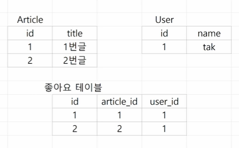
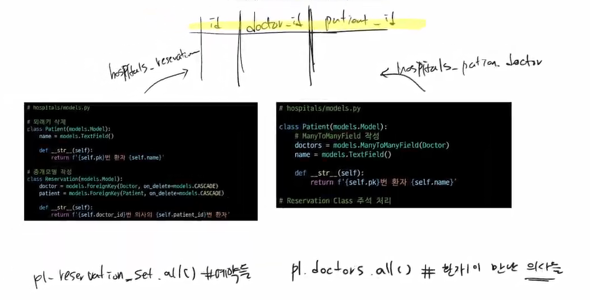
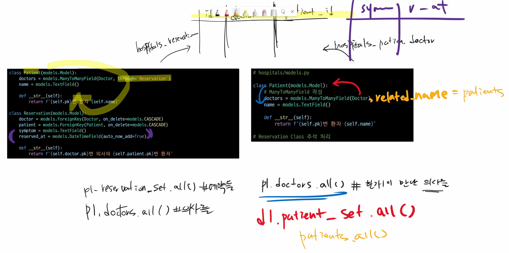

# ✅M:N (Article - User)

> 1. 좋아요 기능의 원리
> 2. 좋아요 기능의 로직
>
> 🗂️ [실습] 좋아요 기능 구현(코드)


## 1. 좋아요 기능의 원리




- 중개 모델(하단 좌측 코드)과 `ManyToManyField `(하단 우측 코드) 비교
  - 중개 모델의 장점 : 예약시간 처방전, 상담내용 등 부가적인 필드를 붙일 수 있음
  - 중개 모델의 단점 : 의사가 본인에게 예약한 환자 전체를 받아보지 못함
    - 반대로 `ManyToManyField `는 의사가 본인에게 예약한 환자 전체를 받아볼 수 있음




- 수업에서 M:N 관계에서는 `related_name` 무조건 쓸 예정

  


---


## 2. 좋아요 기능의 로직

### 2-1. DB에 좋아요 어떻게 기록할 것인지 생각하기 

- Article(M) - User(N)
  - Article 은 0명 이상의 User 에게 좋아요를 받는다. 
  - User 는 0개 이상의 글에 좋아요를 누른다.

### 2-2. 로직 설계

- 상세보기 페이지에서 좋아요 링크(url : `/articles/<int:pk>/like/`)를 누르면, 좋아요를 DB에 추가
- 다시 상세보기 페이지로 redirect
- 로그인한 사용자만 좋아요를 누를 수 있도록 유저정보는 `request.user` 로 받음


---


## 🗂️ [실습] 좋아요 기능 구현(코드)

> [선행작업]
>
> 1. 프로젝트 사전 설정 [(link)](https://github.com/code-sum/TIL/blob/master/notes/dj_modelform2.md)
> 2. accounts app & User model 생성 [(link)](https://github.com/code-sum/TIL/blob/master/notes/dj_auth.md)
> 3. 회원관리 서비스 만들기 [(link)](https://github.com/code-sum/TIL/blob/master/notes/dj_member.md)
> 4. acticles 앱 생성 [(link)](https://github.com/code-sum/TIL/blob/master/notes/dj_modelform2.md)
> 5. 이미지 관리 기능 (22.10.17) [(link)](https://github.com/code-sum/TIL/blob/master/notes/dj_image.md)
> 6. 댓글 기능 (22.10.18) [(link)](https://github.com/code-sum/TIL/blob/master/notes/dj_rdbms1.md)
> 7. accounts 앱과 articles 앱 연동 (22.10.19) [(link)](https://github.com/code-sum/TIL/blob/master/notes/dj_rdbms2.md)


### 1. 모델 관계 설정

> user 와 관련된 ForeignKey 혹은 ManyToManyField 중 하나에 related_name 을 작성하지 않으면, makemigtations 진행했을때 에러가 발생하니 유의

```python
# articles/models.py
# Article 클래스 안에 아래와 같이 like_users 코드 추가

class Article(models.Model):
    title = models.CharField(max_length=20)
    ...
    like_users = models.ManyToManyField(settings.AUTH_USER_MODEL, related_name='like_articles')
```

```bash
# DB 반영

$ python manage.py makemigrations
$ python manage.py migrate
```

### 2. 좋아요 기능 구현

> `articles/views.py` 에서 `if request.user in article.like_users.all():` 부분을 `if article.like_users.filter(id=request.user.id).exist():` 라고 써도 가능

```python
# articles/urls.py

from django.urls import path
from . import views

app_name = 'articles'

urlpatterns = [
    ...,
    path('<int:pk>/like/', views.like, name='like'),
]
```

```python
# articles/views.py

@login_required
def like(request, pk):
    article = Article.objects.get(pk=pk)
    # 만약에 로그인한 유저가 이 글을 좋아요 눌렀다면,
    # if article.like_users.filter(id=request.user.id).exists():
    if request.user in article.like_users.all():
    	# 좋아요를 삭제하고
    	article.like_users.remove(request.user)
    else:
    	# 좋아요 추가하고
	    article.like_users.add(request.user)
    # 상세 페이지로 redirect
    return redirect('articles:detail', pk)
```

```django
<!-- articles/templates/articles/detail.html -->

<!-- 좋아요 버튼 -->

  <div class="ms-3 d-flex align-items-center">
    <form action="" method="POST">
      
      
        <button class="btn btn-link text-danger">
          <svg xmlns="http://www.w3.org/2000/svg" width="16" height="16" fill="currentColor" class="bi bi-suit-heart-fill" viewbox="0 0 16 16">
            <path d="M4 1c2.21 0 4 1.755 4 3.92C8 2.755 9.79 1 12 1s4 1.755 4 3.92c0 3.263-3.234 4.414-7.608 9.608a.513.513 0 0 1-.784 0C3.234 9.334 0 8.183 0 4.92 0 2.755 1.79 1 4 1z"/>
          </svg>
        </button>
      
        <button class="btn btn-link text-danger">
          <svg xmlns="http://www.w3.org/2000/svg" width="16" height="16" fill="currentColor" class="bi bi-suit-heart" viewbox="0 0 16 16">
            <path d="m8 6.236-.894-1.789c-.222-.443-.607-1.08-1.152-1.595C5.418 2.345 4.776 2 4 2 2.324 2 1 3.326 1 4.92c0 1.211.554 2.066 1.868 3.37.337.334.721.695 1.146 1.093C5.122 10.423 6.5 11.717 8 13.447c1.5-1.73 2.878-3.024 3.986-4.064.425-.398.81-.76 1.146-1.093C14.446 6.986 15 6.131 15 4.92 15 3.326 13.676 2 12 2c-.777 0-1.418.345-1.954.852-.545.515-.93 1.152-1.152 1.595L8 6.236zm.392 8.292a.513.513 0 0 1-.784 0c-1.601-1.902-3.05-3.262-4.243-4.381C1.3 8.208 0 6.989 0 4.92 0 2.755 1.79 1 4 1c1.6 0 2.719 1.05 3.404 2.008.26.365.458.716.596.992a7.55 7.55 0 0 1 .596-.992C9.281 2.049 10.4 1 12 1c2.21 0 4 1.755 4 3.92 0 2.069-1.3 3.288-3.365 5.227-1.193 1.12-2.642 2.48-4.243 4.38z"/>
          </svg>
        </button>
      
    </form>
    <div>{{ article.like_users.count }}</div>
  </div>

```

```django
<!-- accounts/templates/accounts/detail.html -->

<div class="mb-4 col-6">
  <h4 class="fw-bold">좋아요 누른 글</h4>
  <p class="text-muted">{{ user.like_articles.count }}개를 좋아합니다.</p>
  
    <p>
      <a class="text-decoration-none" href="">{{ article.title }}</a>
    </p>
  
</div>
```

