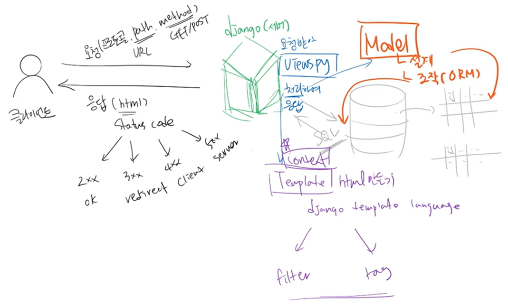
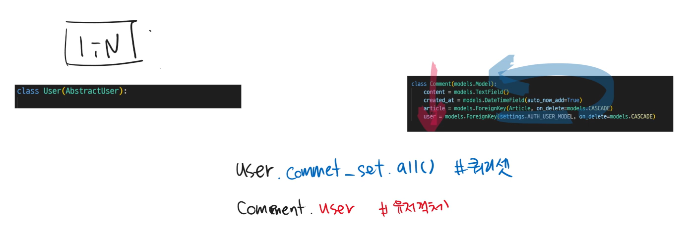
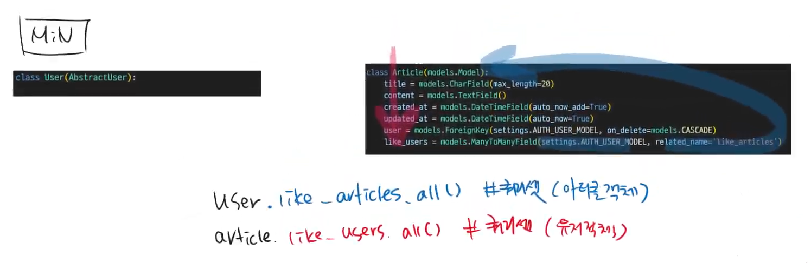
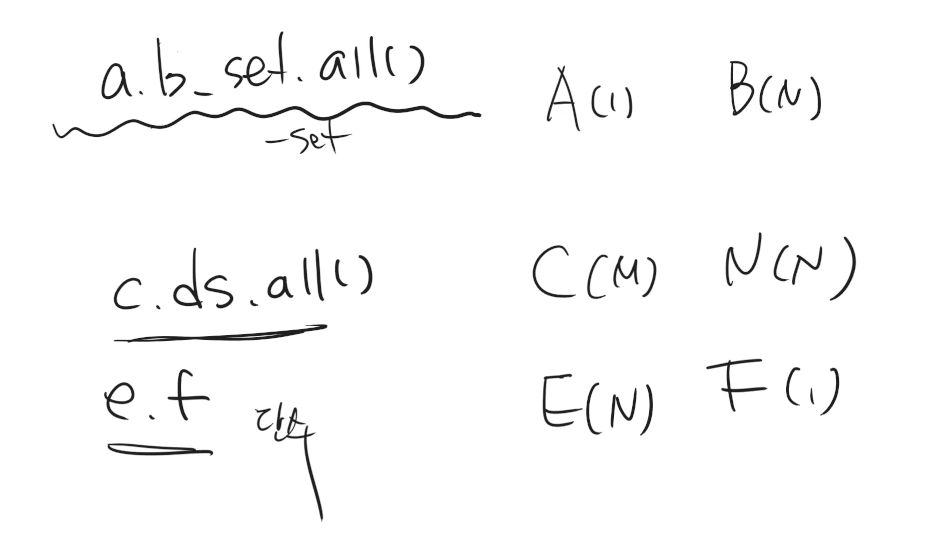
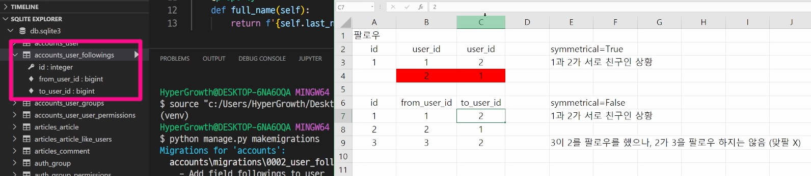

# ✅M:N (User - User)

> 1. Django 개념정리
> 2. 팔로우 기능의 원리
> 3. 팔로우 기능의 로직
>
> 🗂️ [실습] 팔로우 기능 구현(코드)


## 1. Django 개념정리

### 1-1. Django 요청과 응답



### 1-2. Django Model

#### 1-2-1. 1:N



#### 1-2-2. M:N




#### 1-2-3. 코드를 보고 모델 관계 추론




---


## 2. 팔로우 기능의 원리

> 팔로우는 유저와 유저의 M:N 관계

### 2-1. `ManyToManyField()` 활용

- 팔로우도 좋아요 기능처럼 모델이 M:N 구조를 가져야하기 때문에 `ManyToManyField()` 필드를 활용

- User(M) - Article(N) 의 구조였던 좋아요 기능과 달리, 팔로우 기능은 User(M) - User(N) 구조이므로 필드의 괄호 안에 적는 세부 정보가 다름

  - `'self'` 를 적는 이유 👉 [(참고자료1)](https://docs.djangoproject.com/en/4.1/ref/models/fields/#recursive-relationships) [(참고자료2)](https://docs.djangoproject.com/en/4.1/ref/models/fields/#django.db.models.ManyToManyField.symmetrical)

  |        | 좋아요                                                       | 팔로우                                                       |
  | ------ | ------------------------------------------------------------ | ------------------------------------------------------------ |
  | 공통점 | `ManyToManyField()` 필드 활용                                | `ManyToManyField()` 필드 활용                                |
  | 차이점 | `ManyToManyField(settings.AUTH_USER_MODEL, related_name='like_articles')` | `ManyToManyField('self', symmetrical=False, related_name='followers')` |

### 2-2. `symmetrical=True` vs. `symmetrical=False`



- 관계의 대칭성을 묻는 코드
  - 싸이월드 일촌 맺으면, 서로가 서로에게 일촌이 됨 : `symmetrical = True`
  - 페이스북이나 인스타그램 팔로우/팔로잉은 일방향 : `symmetrical = False`


---


## 3. 팔로우 기능의 로직 

>  좋아요 기능과 로직은 똑같음
>
>  (+) 셀프 좋아요는 허용이지만, 셀프 팔로우는 허용할 수 없도록 조건문 더하기

### 3-1. DB에 팔로우 어떻게 기록할 것인지 생각하기

- User(M) - User(N)
  - User(M) 은 0명 이상의 User 로부터 followed
  - User(N) 은 0명 이상의 User 를 following

### 3-2. 로직 설계

- 사용자 프로필 페이지 들어가서 링크(url : `/accounts/<int:pk>/follow/`) 누를 때
- 이미 팔로우 상태면, '팔로우 취소' 버튼 누르며 삭제되고 (remove)

- 팔로우 상태가 아니면, '팔로우' 누르고 추가 (add)
- 작업 완료 후에는 사용자 프로필 페이지로 redirect
- 셀프 팔로우 못하도록(=로그인한 사용자가 프로필 당사자 본인이 아닐 때만 팔로우 가능하도록), 함수와 템플릿에 조건문 작성


---


## 🗂️ [실습] 팔로우 기능 구현(코드)

> [선행작업]
>
> 1. [필수] 프로젝트 사전 설정 [(link)](https://github.com/code-sum/TIL/blob/master/notes/dj_modelform2.md)
> 2. [필수] accounts app & User model 생성 [(link)](https://github.com/code-sum/TIL/blob/master/notes/dj_auth.md)
> 3. [필수] 회원관리 서비스 만들기 [(link)](https://github.com/code-sum/TIL/blob/master/notes/dj_member.md)
> 4. acticles 앱 생성 [(link)](https://github.com/code-sum/TIL/blob/master/notes/dj_modelform2.md)
> 5. 이미지 관리 기능 (22.10.17) [(link)](https://github.com/code-sum/TIL/blob/master/notes/dj_image.md)
> 6. 댓글 기능 (22.10.18) [(link)](https://github.com/code-sum/TIL/blob/master/notes/dj_rdbms1.md)
> 7. accounts 앱과 articles 앱 연동 (22.10.19) [(link)](https://github.com/code-sum/TIL/blob/master/notes/dj_rdbms2.md)
> 8. 좋아요 기능 구현 (22.10.24) [(link)](https://github.com/code-sum/TIL/blob/master/notes/dj_rdbms3.md)


### 1. 모델 관계 설정

```python
# accounts/models.py

class User(AbstractUser):
    followings = models.ManyToManyField('self', symmetrical=False, related_name='followers')
```

```bash
# DB 반영

$ python manage.py makemigrations
$ python manage.py migrate
```

### 2. 팔로우 기능 구현

```python
# accounts/urls.py

urlpatterns = [
    ...,
    path('<int:pk>/follow/', views.follow, name='follow'),
]
```

```python
# accounts/views.py

from django.views.decorators.http import require_POST

@require_POST
def follow(request, pk):
    if request.user.is_authenticated:
        user = get_user_model().objects.get(pk=pk)
        # 프로필에 해당하는 유저와 로그인한 유저가 같으면 클릭해도 그대로
        if request.user == user:
            return redirect('accounts:detail', pk)
        if request.user in user.followers.all():
            # 이미 팔로우 상태이면, '팔로우 취소' 버튼 눌렀을 때 삭제(remove)
            user.followers.remove(request.user)
        else:
            # 팔로우 상태가 아니면, '팔로우' 누르면 추가 (add)
            user.followers.add(request.user)
        return redirect('accounts:detail', pk)
    return redirect ('accounts:login')
```

```django
<!-- accounts/templates/accounts/detail.html -->

<div>
    followings
    {{ user.followings.count }}
    &nbsp;|&nbsp; followers
    {{ user.followers.count }}
</div>

<div class="mt-2">
    <form action="" method="POST">
        
        
        <button type="submit" class="btn btn-outline-danger">팔로우 취소</button>
        
        <button type="submit" class="btn btn-outline-primary">팔로우</button>
        
    </form>
</div>

```

