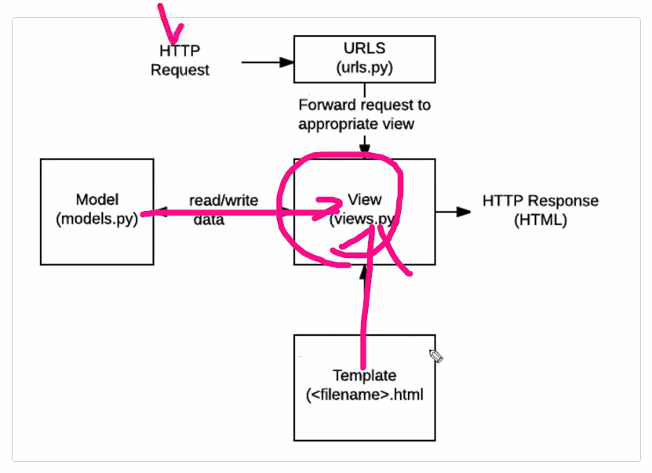
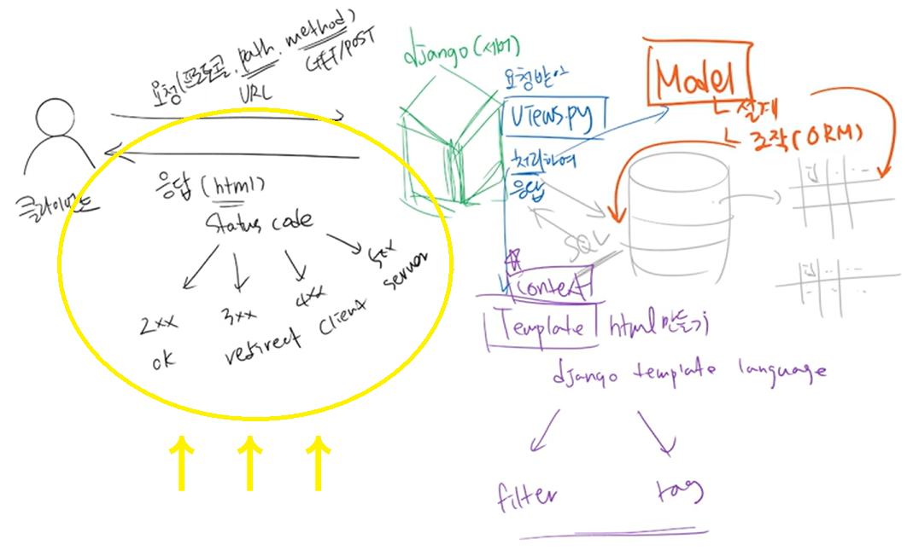
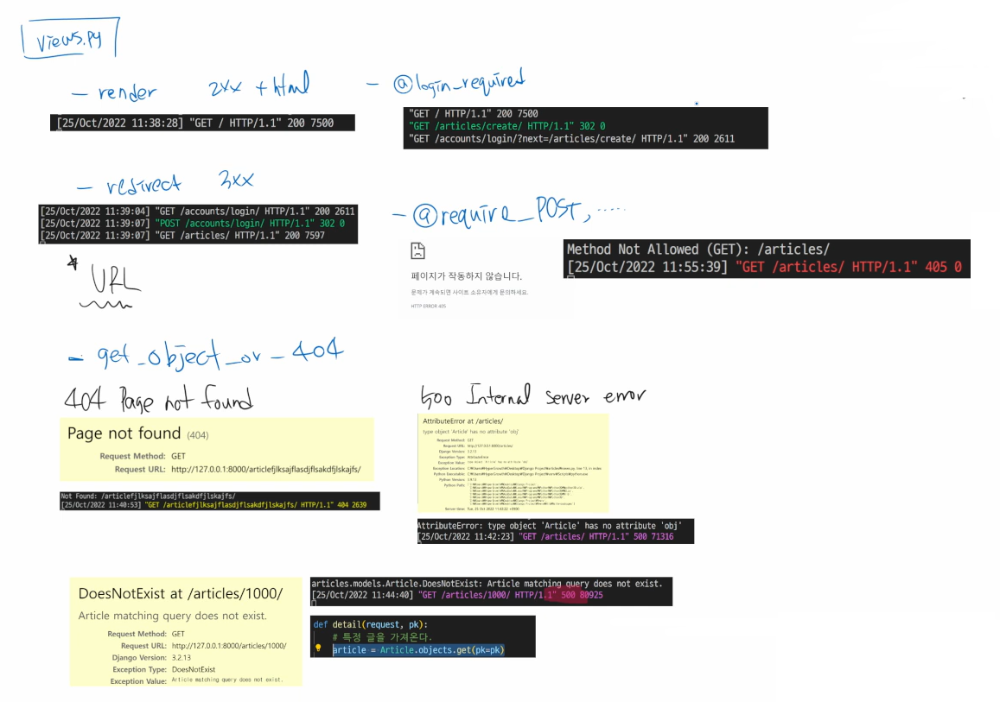

# ✅View functions & decorators 

> 1. `views.py` 의 역할
> 2. `get_objects_or_404` 함수
> 3.  `django.views.decorators.http` 데코레이터


## 1. `views.py` 의 역할

- views.py 는 무조건 `HTTP Response` 객체를 반환 [(이미지출처)](https://developer.mozilla.org/en-US/docs/Learn/Server-side/Django/Introduction)




- Django 서버의 응답 결과는 4가지 status code 로 구분(하단 이미지 노란색 표시 참조)




- `views.py` 에 어떤 코드를 입력했는지에 따라 아래와 같이 각기 다른 status code 도출




---


## 2. `get_objects_or_404` 함수

- `get_objects_or_404` 필요성

  - 브라우저 주소창에 `localhose:8000/articles/999/` 과 같이 아직 작성되지도 않은 글의 주소를 입력하면 서버 로그에 `"GET /articles/3/ HTTP/1.1" 500 80331` 에러가 뜨는데, 이건  서버 로그에 뜨는 것처럼 서버 문제(5XX)가 아니라 클라이언트 문제(4XX)라는 것을 표시하기 위해 `get_objects_or_404` 함수를 활용

- 적용하기

  - 작성하고 있는 프로젝트 폴더에서 `.objects.get(pk=pk)` 를 사용하는 모든 함수 코드를 `get_objects_or_404` 로 수정하기

  ```python
  # accounts/views.py
  
  from django.shortcuts import get_objects_or_404
  
  def detail(request, pk):
      user = get_object_or_404(get_user_model(), pk=pk)
      ...
      
  @require_POST
  def follow(request, pk):
      if request.user.is_authenticated:
          user = get_object_or_404(get_user_model(), pk=pk)
          ...
  ```

  ```python
  # articles/views.py
  
  from django.shortcuts import get_objects_or_404
  
  def detail(request, pk):
      article = get_object_or_404(Article, pk=pk)
      ...
      
  @login_required
  def update(request, pk):
      article = get_object_or_404(Article, pk=pk)
      ...
      
  @login_required
  def comment_create(request, pk):
      article = get_object_or_404(Article, pk=pk)
      ...
  
  @login_required
  def like(request, pk):
      article = get_object_or_404(Article, pk=pk)
      ...
  ```

  

---


## 3. `django.views.decorators.http` 데코레이터

### 3-1. 개요

- `django.views.decorators.http` 의 데코레이터를 사용하여 요청 메서드를 기반으로 접근을 제한할 수 있음
- 일치하지 않는 메서드 요청이라면 405 Method Not Allowed 를 반환
- 메서드 목록
  - `require_http_method()`
  - `require_POST()`
  - `require_safe()`

### 3-2. `require_POST()`

> view 함수가 POST 요청 method 만 허용하도록 하는 데코레이터
>
> url 로 delete 시도 후 서버 로그에서 `405 http status code` 뜨는지 확인

```python
# articles/views.py

from django.views.decorators.http import require_POST

@require_POST
def delete(request, pk):
    article = Article.objects.get(pk=pk)
    article.delete()
    return redirect('articles:index')
```

⚠️ `@require_POST` 를 `@login_required` 와 함께 달아놓으면, `@login_required`의 다음 절차가 제대로 작동하지 않음 👉 따라서 `@login_required`  와 함께 작성해야 하는 상황이라면 아래 코드와 같이 `is_authenticated` 속성 값을 활용해서 조건문 처리

> [ `@require_POST` & `@login_required` 함께 쓸 수 없는 이유]
>
> - 비로그인 상태로 detail 페이지에서 게시글 삭제 시도
> - delete 함수의 `@login_required` 로 인해 로그인 페이지로 redirect
>   - http://127.0.0.1:8000/accounts/login/?next=/articles/1delete/
> - redirect 로 이동한 로그인 페이지에서 로그인 진행
>   - redirect 는 반드시 GET 요청으로만 가능
>     - 즉, redirect 는 POST 요청에 있는 데이터를 redirect 해주는게 아니라, url 만 넘김
> - delete 함수의 `@require_POST` 로 인해 405(Method Not Allowed) status code 반환
>
> 💡 결론 : `@login_required` 는 `views.py` 에서 GET 요청을 처리하는 함수에서만 사용해야함

```python
# accounts/views.py

@require_POST
def delete(request, pk):
    if request.user.is_authenticated:
        user = get_object_or_404(get_user_model(), pk=pk)
        if request.user == user:
            request.user.delete()
            auth_logout(request)
        return redirect('index')
    return redirect ('accounts:login')
```

```python
# articles/views.py

from django.views.decorators.http import require_POST

@require_POST
def delete(request, pk):
    if request.user.is_authenticated:
        article = Article.objects.get(pk=pk)
        if request.user == article.user:
            article.delete()
    return redirect('articles:index')
```

### 3-3. `require_safe()`

> view 함수가 GET 요청 method 만 허용하도록 하는 데코레이터
>
> `require_GET` 도 있지만, Django 에서는 `require_safe` 사용을 권장

```python
# accounts/views.py

@require_safe
def index(request):
    ...
    
@require_safe
def detail(request, pk):
    ...
```

```python
# articles/views.py

@require_safe
def index(request):
    ...
    
@require_safe
def detail(request, pk):
    ...
```

