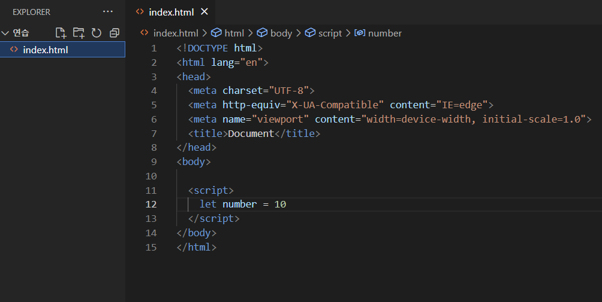
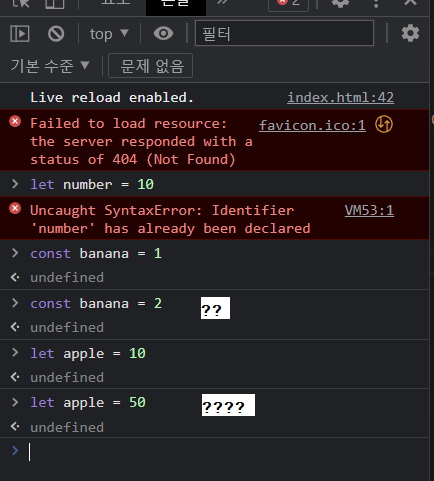
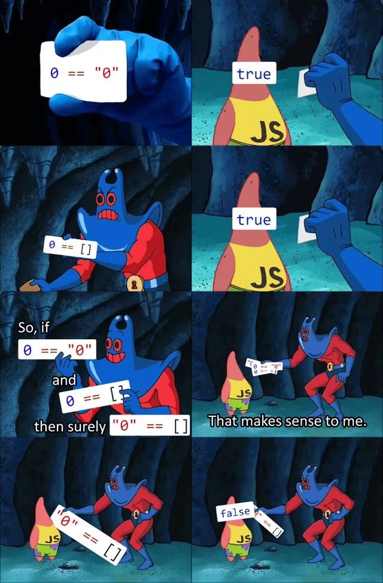

# ✅ ECMA Script

> 1. Introduction
> 1. 변수와 식별자
> 1. 데이터 타입
> 1. 연산자
> 1. 조건문
> 1. 반복문
> 1. 함수
> 1. Arrow Function
> 1. 문자열 (String)
> 1. 배열 (Array)
> 1. 객체 (Objects)
>
> 💡 JavaScript 는 브라우저를 조작하려는 목적으로 시작된 언어기 때문에, 레거시 코드가 많습니다 (레거시 코드: **개발자가 변경하기 두려워하는 코드**)
>
> 🗂️ 심화학습: 이벤트 [(참고서1)](https://developer.mozilla.org/ko/docs/Web/API/EventTarget/addEventListener) [(참고서2)](https://developer.mozilla.org/ko/docs/Learn/JavaScript/Building_blocks/Build_your_own_function)


## 1. Introduction

- 코딩 스타일 가이드
  - 코딩 스타일의 핵심은 합의된 원칙과 일관성
    - 절대적인 하나의 정답은 없으며, 상황에 맞게 원칙을 정하고 일관성 있게 사용하는 것이 중요
  - 코딩 스타일은 코드의 품질에 직결되는 중요한 요소
    - 코드의 가독성, 유지보수 또는 팀원과의 커뮤니케이션 등 개발 과정 전체에 영향을 끼침
  - (참고) 다양한 자바스크립트 코딩 스타일 가이드
    - 처음 습관을 잘 들이는게 좋으니까, **스타일 가이드 보면서 문법 익히기**
    - [Airbnb JavaScript Style Guide](https://github.com/airbnb/javascript)
    - [Google JavaScript Style Guide](https://google.github.io/styleguide/jsguide.html)
    - [standardjs](https://standardjs.com/#javascript-style-guide-linter-and-formatter)


---


## 2. 변수와 식별자

- 변수와 식별자

  - 식별자(identifier)는 변수를 구분할 수 있는 변수명을 말함

  - 식별자는 반드시 문자, 달러($) 또는 밑줄(_)로 시작

  - 대소문자를 구분하며, 클래스명 외에는 모두 소문자로 시작

  - 예약어 사용 불가능

    - 예약어 예시: for, if, function 등

  - (참고) 선언, 할당, 초기화

    ```javascript
    let foo           // 선언
    console.log(foo)  // undefined
    
    foo = 11          // 할당
    console.log(foo)  // 11
    
    let bar = 0       // 선언 + 할당
    console.log(bar)  // 0
    ```
    
    - 선언 (Declaration)
      - 변수를 생성하는 행위 또는 시점
    - 할당 (Assignment)
      - 선언된 변수에 값을 저장하는 행위 또는 시점
    - 초기화 (Initialization)
      - 선언된 변수에 처음으로 값을 저장하는 행위 또는 시점
  


- 변수 선언 [(link)](https://developer.mozilla.org/ko/docs/Web/JavaScript/Guide/Grammar_and_types#%EB%B3%80%EC%88%98_%EC%84%A0%EC%96%B8)

  - `let`, `const` 차이점

    - `let` (재할당 가능)

      ```javascript
      let number = 10      // 1. 선언 및 초기값 할당
      number = 10          // 2. 재할당 가능
      
      console.log(number)  // 10
      ```

    - `const` (재할당 불가능)

      ```javascript
      const number = 10  // 1. 선언 및 초기값 할당
      number = 10        // 2. 재할당 불가능(아래 에러 발생)
      // Uncaught TypeError: Assignment to constant variable.
      ```

    

  - `let`, `const` 공통점1 (vs. `var`)

    - `let` (재선언 불가능)
  
      ```javascript
      let number = 10  // 1. 선언 및 초기값 할당
      let number = 50  // 2. 재선언 불가능(아래 에러 발생)
      // Uncaught SyntaxError: Identifier 'number' has already been declared.
      ```

    - `const` (재선언 불가능)
  
      ```javascript
      const number = 10  // 1. 선언 및 초기값 할당
      const number = 50  // 2. 재선언 불가능(아래 에러 발생)
      // Uncaught SyntaxError: Identifier 'number' has already been declared.
      ```
  
      ⚠️유의: 크롬 콘솔창에서는 `let` 과 `const` 재선언 가능 [(link)](https://stackoverflow.com/questions/64582489/why-can-let-be-re-declared-in-the-devtools-console-in-chrome-other-browsers)

      

      

    
  
  - `let`, `const` 공통점2 (vs. `var`)
  
    - 블록 스코프(block scope)
      - if, for, 함수 등의 중괄호 내부를 가리킴
      - 블록 스코프를 가지는 변수는 블록 바깥에서 접근 불가능
      
      ```javascript
      let x = 1
      
      if (x === 1) {
          let x = 2
          console.log(x)  // 2
      }
      
      console.log(x)      // 1
      ```
  
    
  
  - `var` 
  
    - ES6 이전에 변수를 선언할 때 사용되던 키워드
  
    - `var` 로 선언한 변수는 **재선언 및 재할당 모두 가능**
  
      ```javascript
      var number = 10  // 1. 선언 및 초기값 할당
      var number = 50  // 2. 재할당
      
      console.log(number)  // 50
      ```
  
    - 함수 스코프(function scope)
  
      ```javascript
      function foo() {
          var x = 5
          console.log(x)  // 5
      }
      
      console.log(x)  // ReferenceError: x is not defined
      ```
  
      - 함수 스코프는 함수의 중괄호 내부를 가리킴
      - 함수 스코프를 가지는 변수는 함수 바깥에서 접근 불가능
  
    - **호이스팅(hoisting)** 특성으로 인해 예기치 못한 문제 발생 가능
  
      ```javascript
      console.log(username)  // undefined
      var username = '홍길동'
      
      console.log(email)     // Uncaught ReferenceError
      let email = 'abc@gmail.com'
      
      console.log(age)       // Uncaught ReferenceError
      const age = 50
      ```
  
      - 변수 선언 이전에 참조(`console.log()`)를 할 수 있는 현상
      - 변수 선언 이전의 위치에서 접근 시 `undefined` 반환
      - JavaScript 는 모든 선언을 호이스팅함
      - 즉, `var`, `let`, `const` 모두 호이스팅이 발생하지만, `var`는 선언과 초기화가 동시에 발생하여 일시적인 사각지대가 존재하지 않음
      - 이러한 이유 때문에 **ES6 이후부터는 var 대신 const 와 let 사용을 권장**
  
    
  
  - `let`, `const`, `var` 비교
  
    | 키워드  | 재선언 | 재할당 | 스코프      | 비고  |
    | ------- | ------ | ------ | ----------- | ----- |
    | `let`   | X      | O      | 블록 스코프 | ES6 ~ |
    | `const` | X      | X      | 블록 스코프 | ES6 ~ |
    | `var`   | O      | O      | 함수 스코프 | 비추👎 |
  
    

---


## 3. 데이터 타입

- 데이터 타입
  - 자바스크립트의 모든 값은 특정한 데이터 타입을 가짐
  - 크게 원시 타입(Primitive type)과 참조 타입(Reference type) 으로 분류됨


- 원시 타입(Primitive type)

  - Number, String, Boolean, undefined, null, Symbol
  - 객체(object)가 아닌 기본 타입
  - 변수에 해당 타입의 값이 담김
  - 다른 변수에 복사할 때 실제 값이 복사됨

  ```javascript
  let message = '안녕하세요!'  // 1. message 선언 및 할당
  
  let greeting = message     // 2. greeting 에 message 복사
  console.log(greeting)      // 3. '안녕하세요!' 출력
  
  message = 'Hello, world!'  // 4. message 재할당
  console.log(greeting)      // 5. '안녕하세요!' 출력
  
  // 즉, 원시 타입은 실제 해당 타입의 값을 변수에 저장함
  ```


- 참조 타입(Reference type) 

  - Array, Function, ... etc. ⊂ Objects ⊂ Reference type
  - 객체(object) 타입의 자료형
  - 변수에 해당 객체의 참조 값이 담김
  - 다른 변수에 복사할 때 참조 값이 복사됨

  ```javascript
  const message = ['안녕하세요!']  // 1. message 선언 및 할당
  
  const greeting = message       // 2. greeting 에 message 복사
  console.log(greeting)          // 3. ['안녕하세요!'] 출력
  
  message[0] = 'Hello, world!'   // 4. message 재할당
  console.log(greeting)          // 5. ['Hello, world!'] 출력
  
  // 즉, 참조 타입은 해당 객체를 참조할 수 있는 참조 값을 저장함
  ```

  

- [Primitive] 숫자 타입(Number)
  
  - 정수, 실수 구분 없는 하나의 숫자 타입
  - 부동소수점 형식을 따름
  - (참고) NaN (Not-A-Number)
    - 계산 불가능한 경우 반환되는 값
      - ex) 'Angel' / 1004 => NaN
  
  ```javascript
  const a = 13         // 양의 정수
  const b = -5         // 음의 정수
  const c = 3.14       // 실수
  const d = 2.998e8    // 거듭제곱
  const e = Infinity   // 양의 무한대
  const f = -Infinity  // 음의 무한대
  const g = NaN        // 산술 연산 불가
  ```
  
  

- [Primitive] 문자열 타입(String)
  
  - 텍스트 데이터를 나타내는 타입
  - 16비트 유니코드 문자의 집합
  - 작은따옴표 또는 큰따옴표 모두 가능
  - 템플릿 리터럴(Template Literal)
    - ES6부터 지원
    - 따옴표 대신 backtick(``)으로 표현
    - ${expression} 형태로 삽입 가능
  
  ```javascript
  const firstName = 'Brandan'
  const lastName = 'Eich'
  const fullName = '${firstName} ${lastName}'
  
  console.log(fullName)  // Brandan Eich
  ```
  
  

- [Primitive] undefined

  - 변수의 값이 없음을 나타내는 데이터 타입
  - 변수 선언 이후 직접 값을 할당하지 않으면, 자동으로 undefined 가 할당됨

  ```javascript
  let firstName
  console.log(firstName)  // undefined
  ```

  

- [Primitive] null
  
  - 변수의 값이 없음을 의도적으로 표현할 때 사용하는 데이터 타입
  - (참고) null 타입과 typeof 연산자 (세부 내용은 중요하지 않음)
    - typeof 연산자: 자료형 평가를 위한 연산자
    - null 타입은 [ECMA 명세의 원시 타입 정의](https://tc39.es/ecma262/#sec-primitive-value)에 따라 원시 타입에 속하나, typeof 연산자 결과는 객체(object)로 표현됨 [(link)](https://2ality.com/2013/10/typeof-null.html)
  
  ```javascript
  let firstName = null
  console.log(firstName)  // null
  
  typeof null  // object
  ```
  
  

- [Primitive] Boolean 타입

  - 논리적 참 또는 거짓을 나타내는 타입
  - true 또는 false 로 표현됨
  - 조건문 또는 반복문에서 유용하게 사용
    - (참고) 조건문 또는 반복문에서 boolean이 아닌 데이터 타입은 [자동 형변환 규칙](https://tc39.es/ecma262/#sec-type-conversion)에 따라 true 또는 false로 변환됨

  ```javascript
  let isAdmin = true
  console.log(isAdmin)  // true
  
  isAdmin = false
  console.log(isAdmin)  // false
  ```

  

- (참고) [ToBoolean Conversions (자동 형변환)](https://tc39.es/ecma262/#sec-toboolean) 정리

  | 데이터 타입 | 거짓       | 참               |
  | ----------- | ---------- | ---------------- |
  | `undefined` | 항상 거짓  | X                |
  | `null`      | 항상 거짓  | X                |
  | Number      | 0, -0, NaN | 나머지 모든 경우 |
  | String      | 빈 문자열  | 나머지 모든 경우 |
  | Object      | X          | 항상 참          |

  

---


## 4. 연산자

- 할당 연산자
  - 오른쪽에 있는 피연산자의 평가 결과를 왼쪽 피연산자에 할당하는 연산자
  - 다양한 연산에 대한 단축 연산자 지원
  - (참고) Increment 및 Decrement 연산자
    - 파이썬이랑 다른 부분!
    - Increment(++): 피연산자 값을 1 증가시키는 연산자
    - Decrement(--): 피연산자 값을 1 감소시키는 연산자
    - [Airbnb Style Guide](https://github.com/airbnb/javascript#variables--unary-increment-decrement) 에서는 '+=' 또는 '-=' 와 같이 더 분명한 표현으로 적을 것을 권장
  
  ```javascript
  let x = 0
  
  x += 10
  console.log(x)  // 10
  
  x -= 3
  console.log(x)  // 7
  
  x *= 10
  console.log(x)  // 70
  
  x /= 10
  console.log(x)  // 7
  
  x++             // += 1 연산과 동일
  console.log(x)  // 8
  
  x--             // -= 1 연산과 동일
  console.log(x)  // 7
  ```


- 비교 연산자

  - 피연산자를 비교하고 결과값을 boolean으로 반환하는 연산자
  - 문자열은 유니코드 값을 사용하며 표준 사전 순서를 기반으로 비교
    - ex) 알파벳끼리 비교할 경우
      - 알파벳 순서상 후순위가 더 크다
      - 소문자가 대문자보다 더 크다

  ```javascript
  const numOne = 1
  const numTwo = 100
  console.log(numOne < numTwo)   // true
  
  const charOne = 'a'
  const charTwo = 'z'
  console.log(charOne > charTwo)  // false
  ```

  

- 동등 비교 연산자(==)

  - 두 피연산자가 같은 값으로 평가되는지 비교 후 boolean 값을 반환

  - 비교할 때 [암묵적 타입 변환](https://262.ecma-international.org/5.1/#sec-11.9.3)을 통해 타입을 일치시킨 후 같은 값인지 비교

  - 두 피연산자가 모두 객체일 경우 메모리의 같은 객체를 바라보는지 판별

  - 예상치 못한 결과가 발생할 수 있으므로 [특별한 경우](https://google.github.io/styleguide/jsguide.html#features-equality-checks-exceptions)를 제외하고 사용하지 않음

    

  ```javascript
  const a = 1004
  const b = '1004'
  console.log(a == b)  // true
  
  const c = 1
  const d = true
  console.log(c == d)  // true
  
  // 자동 타입 변환 예시
  console.log(a + b)   // 10041004
  console.log(c + d)   // 2
  ```

  

- 일치 비교 연산자(===)
  - **JavaScript 에서는 이퀄 기호를 무조건 === 로 쓴다는 사실을 기억하자!**
  - 두 피연산자가 같은 값으로 평가되는지 비교 후 boolean 값을 반환
  - [엄격한 비교](https://262.ecma-international.org/5.1/#sec-11.9.6)가 이뤄지며 암묵적 타입 변환이 발생하지 않음
    - 엄격한 비교란? 두 비교 대상의 타입과 값 모두 같은지 비교
  
  ```javascript
  const a = 1004
  const b = '1004'
  console.log(a === b)  // false
  
  const c = 1
  const d = true
  console.log(c === d)  // false
  ```
  
  

- 논리 연산자
  - 3가지 논리 연산자로 구성
    - and 연산은 '&&' 연산자를 이용
    - or 연산은 '||' 연산자를 이용
    - not 연산은 '!' 연산자를 이용
  - 단축 평가 지원
    - ex) false && true => false
    - ex) true || false => true
  
  ```javascript
  /*
  	and 연산
  */
  console.log(true && false)   // false
  console.log(true && true)    // true
  console.log(1 && 0)          // 0
  console.log(4 && 7)          // 7
  console.log('' && 5)         // ''
  
  /*
  	or 연산
  */
  console.log(true || false)   // true
  console.log(false || false)  // false
  console.log(1 || 0)          // 1
  console.log(4 || 7)          // 4
  console.log('' || 5)         // 5
  
  /*
  	not 연산
  */
  console.log(!true)           // false
  console.lod(!'Bonjour!')     // false
  ```
  
  

- 삼항 연산자(Ternary Operator)
  - 세 개의 피연산자를 사용하여 조건에 따라 값을 반환하는 연산자
  - if 문까지 짤 필요는 없을 것 같을 때 활용!
  - 가장 왼쪽의 조건식이 참이면 콜론(:) 앞의 값을 사용하고 그렇지 않으면 콜론(:) 뒤의 값을 사용
  - 삼항 연산자의 결과 값이기 때문에 변수에 할당 가능
  - (참고) [한 줄에 표기하는 것을 권장](https://github.com/airbnb/javascript#comparison--nested-ternaries)
  
  ```javascript
  console.log(true ? 1 : 2)   // 1
  console.log(false ? 1 : 2)  // 2
  
  const result = math.PI > 4 ? 'Yes' : 'No'
  console.log(result)  // No
  ```
  
  

---


## 5. 조건문

- 조건문의 종류와 특징
  - 'if' statement
    - 조건 표현식의 결과값을 Boolean 타입으로 변환 후 참/거짓을 판단
    - 파이썬이랑 다르게 들여쓰기(indentation) 기반으로 동작하는게 아니기 때문에 구조를 정확하게 써주는게 중요
    - if, else if, else 구조
    - 조건은 소괄호(condition) 안에 작성
    - 실행할 코드는 중괄호{} 안에 작성
    - 블록 스코프 생성
  
  ```javascript
  if (condition) {
      // do something
  } else if (condition) {
      // do something
  } else {
      // do something
  }
  ```
  
  ```javascript
  const nation = 'Korea'
  if (nation === 'Korea') {
      console.log('안녕하세요!')
  } else if (nation === 'France') {
      console.log('Bonjour!')
  } else {
      console.log('Hello!')
  }
  ```
  
  
  
  - 'switch' statement
    - 표현식(expression)의 결과값이 어느 값(case)에 해당하는지 판별
    - 주로 특정 변수의 값에 따라 조건을 분기할 때 활용
      - 조건문이 많아질 경우 if문보다 가독성이 나을 수 있음
    - 표현식의 결과값과 case 문의 오른쪽 값을 비교
    - break 및 default문은 [선택적]으로 사용 가능
    - break문을 만나거나 default문을 실행할 때까지 다음 조건문 실행
  
  ```javascript
  switch(expression) {
      case 'first value': {
     	    // do something
          [break]
      }
      case 'second value': {
          // do something
          [break]
      }
      [default: {
           // do something
       }]
  }
  ```
  
  ```javascript
  const nation = 'Korea'
  
  switch(nation) {
      case 'Korea': {
          console.log('안녕하세요!')
      }
      case 'France': {
          console.log('Bonjour!')
      }
      default: {
          console.log('Hello!')
      }
  }
  
  /* 
  위의 경우 출력값이 아래와 같음
  (Fall-through, 이 경우에는 모두 출력)
  
  안녕하세요!
  Bonjour!
  Hello!
  */
  ```


- if 문과 switch 문 사례로 비교해보기

  ```javascript
  const numOne = 5
  const numTwo = 10
  let operator = '+'
  
  if (operator === '+') {
      console.log(numOne + numTwo)
  } else if (operator === '-') {
      console.log(numOne - numTwo)
  } else if (operator === '*') {
      console.log(numOne * numTwo)
  } else if (operator === '/') {
      console.log(numOne / numTwo)
  } else {
      console.log('유효하지 않은 연산자입니다.')
  }
  
  // 15
  ```

  ```javascript
  const numOne = 5
  const numTwo = 10
  let operator = '+'
  
  switch(operator) {
      case '+': {
          console.log(numOne + numTwo)
          break
      }
      case '-': {
          console.log(numOne - numTwo)
          break
      }
      case '*': {
          console.log(numOne * numTwo)
          break
      }
      case '/': {
          console.log(numOne / numTwo)
          break
      }
      default: {
          console.log('유효하지 않은 연산자입니다.')
      }
  }
  
  // 15
  ```

  

---


## 6. 반복문

- 반복문의 종류와 특징
  - while
    - 조건문이 참(true)인 동안 반복 시행
    - 조건은 소괄호 안에 작성
    - 실행할 코드는 중괄호 안에 작성
    - 블록 스코프 생성
  
  ```javascript
  while (condition) {
      // do something
  }
  ```
  
  ```javascript
  let i = 0
  while (i<6) {
      console.log(i)
      i += 1
  }
  
  /*
  위 코드 작성시 출력값은 아래와 같음
  
  0
  1
  2
  3
  4
  5
  */
  ```
  
  
  
  - for
    - 세미콜론(;)으로 구분되는 세 부분으로 구성
    - `initialization`
      - 최초 반복문 진입 시 1회만 실행되는 부분
    - `condition`
      - 매 반복 시행 전 평가되는 부분
    - `expression`
      - 매 반복 시행 이후 평가되는 부분
    - 블록 스코프 생성
  
  ```javascript
  for (initialization; condition; expression) {
      // do something
  }
  ```
  
  
  
  - for ... in (객체 순회 적합)
    - 주로 객체(object)의 속성(key)들을 순회할 때 사용
    - 배열도 순회 가능하지만 인덱스 순으로 순회한다는 보장이 없으므로 권장하지 않음
    - 실행할 코드는 중괄호 안에 작성
    - 블록 스코프 생성
  
  ```javascript
  for (variable in object) {
      // do something
  }
  ```
  
  ```javascript
  // object(객체) => key-value로 이루어진 자료구조 (객체 챕터에서 학습 예정)
  const capitals = {
      korea: 'seoul',
      france: 'paris',
      USA: 'washington D.C.'
  }
  
  for (let capital in capitals) {
      console.log(capital)
  }
  
  /*
  korea
  france
  USA
  */
  ```
  
  
  
  - for ... of (배열 순회 적합)
    - 반복 가능한(iterable) 객체를 순회하며 값을 꺼낼 때 사용
    - 반복 가능한 객체의 종류: Array, Map, Set, String 등
    - 실행할 코드는 중괄호 안에 작성
    - 블록 스코프 생성
  
  ```javascript
  for (variable of iterables) {
      // do something
  }
  ```
  
  ```javascript
  const fruits = ['딸기', '바나나', '메론']
  
  for (let fruit of fruits) {
      fruit = fruit + '!'
      console.log(fruit)
  }
  
  /*
  딸기!
  바나나!
  메론!
  */
  ```


- (참고) `for ... in` vs. `for ... of` 비교하기

  ```javascript
  💡 for ... in (객체 순회에 적합)
  
  // array
  const fruits = ['딸기', '바나나', '메론']
  
  for (let fruit in fruits) {
      console.log(fruit)
  }
  /*
  0
  1
  2
  */
  
  // object
  const capitals = {
      Korea: '서울',
      France: '파리',
      USA: '워싱턴 D.C.'
  }
  
  for (let capital in capitals) {
      console.log(capital)
  }
  /*
  Korea
  France
  USA
  */
  ```

  ```javascript
  💡 for ... of (배열 순회에 적합)
  
  // array
  const fruits = ['딸기', '바나나', '메론']
  
  for (let fruit of fruits) {
      console.log(fruit)
  }
  /*
  딸기
  바나나
  메론
  */
  
  // object
  const capitals = {
      Korea: '서울'
      France: '파리'
      USA: '워싱턴 D.C.'
  }
  
  for (let capital of capitals) {
      console.log(capital)
  }
  // Uncaught TypeError: capitals is not iterable
  ```

  

---


## 7. 함수

> JavaScript 에서는 특히나 함수가 중요! **콜백함수** 패턴이 특히 중요!
>
> 🗂️ [(참고서)](https://developer.mozilla.org/ko/docs/Learn/JavaScript/Building_blocks/Functions)


- 함수 in JavaScript
  - 참조 타입 중 하나로써 function 타입에 속함
  - JavaScript 에서 함수를 정의하는 방법은 주로 2가지로 구분
    - 함수 선언식 (function declaration)
    - 함수 표현식 (function expression)
  - (참조) JavaScript 의 함수는 [일급 객체(First-class citizen)](https://developer.mozilla.org/ko/docs/Glossary/First-class_Function) 이건 파이썬과도 동일!
    - 일급 객체: 다음의 조건들을 만족하는 객체를 의미
      - 변수에 할당 가능
      - 함수의 매개변수로 전달 가능
      - 함수의 반환 값으로 사용 가능


- 함수의 정의
  - 함수의 이름과 함께 정의하는 방식
  - 3가지 부분으로 구성
    - 함수의 이름 (name)
    - 매개변수 (args)
    - 함수 body (중괄호 내부)
  
  ```javascript
  function name(args) {
      // do something
  }
  ```
  
  ```javascript
  function add(num1, num2) {
      return num1 + num2
  }
  
  add(1, 2)
  ```
  
  

- 함수 표현식(function expression)
  - 함수를 표현식 내에서 정의하는 방식
    - (참고) 표현식: 어떤 하나의 값으로 결정되는 코드의 단위
  - 함수의 이름을 생략하고 익명 함수로 정의 가능
    - 익명 함수(anonymous function): 이름이 없는 함수
    - 익명 함수는 함수 표현식에서만 가능
  - 3가지 부분으로 구성
    - 함수의 이름 (생략 가능)
    - 매개 변수 (args)
    - 함수 body (중괄호 내부)
  
  ```javascript
  const name = function name(args) {
      // do something
  }
  ```
  
  ```javascript
  const add = function add(num1, num2) {
      return num1 + num2
  }
  
  add(1, 2)
  ```


- 기본 인자(default arguments)

  - 인자 작성 시 '=' 문자 뒤 기본 인자 선언 가능

  ```javascript
  const greeting = function (name = 'Anonymous') {
      return 'Hi ${name}'
  }
  
  greeting()  // Hi Anonymous
  ```


- 매개변수와 인자의 개수 불일치 허용

  - 매개변수보다 인자의 개수가 많을 경우

  ```javascript
  const noArgs = function () {
      return 0
  }
  
  noArgs(1, 2, 3)  // 0
  
  const twoArgs = function (arg1, arg2) {
      return [arg1, arg2]
  }
  
  twoArgs(1, 2, 3)  // [1, 2]
  ```

  - 매개변수보다 인자의 개수가 적을 경우

  ```javascript
  const threeArgs = function (arg1, arg2, arg3) {
      return [arg1, arg2, arg3]
  }
  
  threeArgs()      // [undefined, undefined, undefined]
  threeArgs(1)     // [1, undefined, undefined]
  threeArgs(1, 2)  // [1, 2, undefined]
  ```


- Rest Parameter

  - rest parameter(...)를 사용하면 함수가 정해지지 않은 수의 매개변수를 배열로 받음 (python 의 *args) 와 유사
    - 만약 rest parameter 로 처리한 매개변수에 인자가 넘어오지 않을 경우에는, 빈 배열로 처리

  ```javascript
  const restArg = function (arg1, arg2, ...restArgs) {
      return [arg1, arg2, restArgs]
  }
  
  restArg(1, 2, 3, 4, 5)  // [1, 2, [3, 4, 5]]
  restArg(1, 2)           // [1, 2, []]
  ```


- Spread operator

  - spread operator(...)를 사용하면 배열 인자를 전개하여 전달 가능

  ```javascript
  const spreadOpr = function (arg1, arg2, arg3) {
      return arg1 + arg2 + arg3
  }
  
  const numbers = [1, 2, 3]
  spreadOpr(...numbers)  // 6
  ```


- 함수 선언식과 표현식 비교 정리

  |        | 함수 선언식(declaration)     | 함수 표현식(expression)                                      |
  | ------ | ---------------------------- | ------------------------------------------------------------ |
  | 공통점 | 데이터 타입, 구성 요소       | 데이터 타입, 구성 요소                                       |
  | 차이점 | 익명 함수 불가능, 호이스팅 O | 익명 함수 가능, 호이스팅 X                                   |
  | 비고   |                              | [Airbnb Style Guide 권장 방식](https://github.com/airbnb/javascript#functions--declarations) |


- 함수의 타입

  - 선언식 함수와 표현식 함수의 타입은 모두 function 으로 동일함

  ```javascript
  // 함수 선언식
  function sub(args) {}
  
  // 함수 표현식
  const add = function (args) {}
  
  console.log(typeof sub)  // function
  console.log(typeof add)  // function
  ```

  

- 호이스팅(hoisting) O - 함수 선언식

  - 함수 선언식으로 선언한 함수는 var로 정의한 변수처럼 hoisting 발생
  - 함수 호출 이후에 선언 해도 동작

  ```javascript
  add(2, 7)  // 9
  function add (num1, num2) {
      return num1 + num2
  }
  ```

  

- 호이스팅(hoisting) X - 함수 표현식

  - 반면 함수 표현식으로 선언한 함수는 함수 정의 전에 호출 시 에러 발생
  - 함수 표현식으로 정의된 함수는 변수로 평가되어 변수의 scope 규칙을 따름

  ```javascript
  sub(7, 2)  // Uncaught ReferenceError: Cannot access 'sub' before initialization
  
  const sub = function (num1, num2) {
      return num1 - num2
  }
  ```

  - 함수 표현식을 아래와 같이 var 키워드로 작성한 경우, 변수가 선언되기 전에 undefined 로 초기화 되어 다른 에러가 발생

  ```javascript
  console.log(sub)  // undefined
  sub(7, 2)  // Uncaught TypeError: sub is not a function
  
  var sub = function (num1, num2) {
      return num1 - num2
  }
  ```

  

---


## 8. Arrow Function

> Q. 모든 함수를 Arrow Function 으로 써도 되나요?
>
> ​	A. 지금 여러분이 쓰는 문법 수준에서는 크게 문제가 될게 없습니다.
>
> 🗂️ [(참고서)](https://developer.mozilla.org/ko/docs/Web/JavaScript/Reference/Functions/Arrow_functions)


- 함수와 화살표 함수의 차이 [(link)](https://developer.mozilla.org/ko/docs/Web/JavaScript/Reference/Operators/this)
  - 2022-09-20 수업 예정(this 개념과 함께)


- 화살표 함수 (Arrow Function)

  - 함수를 비교적 간결하게 정의할 수 있는 문법
  - function 키워드 생략 가능
  - 함수의 매개변수가 단 하나 뿐이라면, '()'도 생략 가능
  - 함수 body 표현식이 하나라면, '{}' 과 return 도 생략 가능
  - 기존 function 키워드 사용 방식과의 차이점은 후반부 this 키워드를 학습하고 다시 설명

  ```javascript
  const arrow1 = function (name) {
      return 'hello, ${name}'
  }
  
  // 1. function 키워드 삭제 가능
  const arrow2 = (name) => {return 'hello, ${name}'}
  
  // 2. 매개변수가 1개일 경우에만 () 생략 가능
  const arrow3 = name => {return 'hello, ${name}'}
  
  // 3. 함수 body가 return을 포함한 표현식 1개일 경우, {}&return 삭제 가능
  const arrow4 = name => 'hello, ${name}'
  ```

  

---


## 9. 문자열 (String)

> 메서드 다 외울 필요는 없고 파이썬이랑 비교해보면서 익혀둡시다


---


## 10. 배열 (Array)

> 여기도 메서드 다 외울 필요는 없습니다
>
> [(참고서1)](https://developer.mozilla.org/ko/docs/Web/JavaScript/Reference/Global_Objects/Array) [(참고서2)](https://developer.mozilla.org/ko/docs/Web/JavaScript/Reference/Global_Objects/Array/map) [(참고서3)](https://developer.mozilla.org/ko/docs/Web/JavaScript/Reference/Global_Objects/Array/forEach)


- join
  - 파이썬에서는 join 이 문자열의 매서드였는데, JS는 배열의 메서드라는 점 기억!


- 콜백지옥 img
  - https://velog.io/@ko1586/Callback%ED%95%A8%EC%88%98%EB%9E%80-%EB%AD%94%EB%8D%B0 글이랑 같이 보기


---


## 11. 객체 (Objects)

>[(참고서)](https://developer.mozilla.org/ko/docs/Learn/JavaScript/Objects/Basics)

04_event.html 코드 복습해보면, addeventlistener click 안에 들어가있던 function() 이 콜백함수!


- JSON [(link)](https://developer.mozilla.org/ko/docs/Learn/JavaScript/Objects/JSON)


