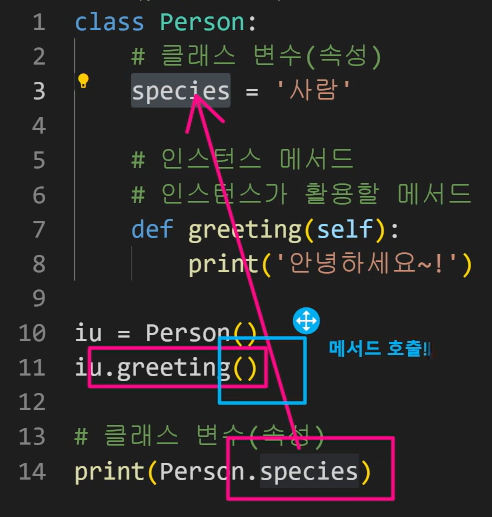
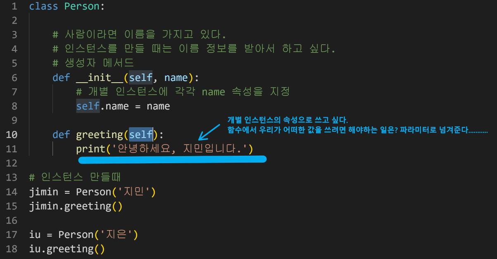
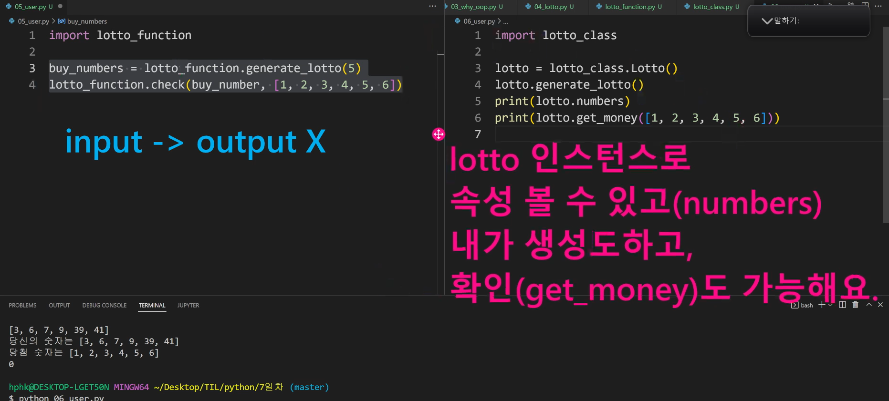

# ✅객체지향 프로그래밍(OOP) 심화

> _"클래스(class, 어원: classification)는 객체 지향 프로그래밍(OOP)에서 특정 객체를 생성하기 위해 변수와 메소드를 정의하는 일종의 틀(template)이다. 객체를 정의하기 위한 메소드와 변수로 구성된다."_ [(link)](https://ko.wikipedia.org/wiki/%ED%81%B4%EB%9E%98%EC%8A%A4_(%EC%BB%B4%ED%93%A8%ED%84%B0_%ED%94%84%EB%A1%9C%EA%B7%B8%EB%9E%98%EB%B0%8D))

- Intro
  - 알고리즘 문제를 푸는 동안에 클래스를 직접 만드는 경우는 잘 없지만, Django 등 프레임워크를 활용해 웹 개발을 시작하면 클래스를 구현해야 하는 상황이 생김

정의가 중요

함수: 인풋이 들어오면 아웃풋을 리턴한다!

객체: 속성과 매서드가 모두 존재하는 하나의 모습!

그 모습을 클래스로 정의해놓고, 실제로 활용하는 것은 개별 인스턴스!

self 에 대한 설명(0720_2 그림 / 02_self.py 참조)

모든 인스턴스 중에 첫번째로 self를 넘겨준다는 약속이 되어있다!

파이썬은 self 가 각 인스턴스를 넘겨주는 식으로 구성이 되어있음

self 를 줄여서 s로 써도 되긴하지만, 이건 너무 힙스터다!

클래스를 어떤 상황에서 쓰는게 좋은가요?(03_why_oop.py 참조)

포켓몬에서 내 야스오, 상대편 야스오 인스턴스를 만들어 나가고 싶을 때

로또 코드 발전시켜보기 

- 1게임이 아니라, 5게임이 출력되도록 구성하고 싶다면 반복문 이용하기
- 반복문 대신, 함수화하기
- 하나의 기능을 클래스로 만들기(lotto_class.py)
- 클래스로 만들어진 코드에 인스턴스도 넣고 확장시켜가며 기능,값,매서드,함수를 활용할 수 있다 (0720_3.png 참조)

- 클래스 속성(attribute)
  - 한 클래스의 모든 인스턴스라도 똑같은 값을 가지고 있는 속성
  - 클래스 선언 내부에서 정의
  - `<classname>.<name>` 의 규칙으로 접근 및 할당

인스턴스 매서드: 인스턴스가 호출하면서 매서드 자체에 인스턴스가 필요한 경우에 쓰기

클래스 매서드: 클래스가 호출을 할건데, 내부적으로 매서드 자체에 클래스가 필요한 경우

스태틱 매서드: 매서드 자체에 클래스, 인스턴스가 필요 없을 때

* 스태틱 메서드 안에서 클래스, 인스턴스 절대! 쓸 수 없다(넘겨주지도 않기 때문)

객체 지향의 핵심개념

추상화

상속: 코드의 양이 많이 줄어듬

* 매소드 오버라이딩: 매소드를 덮어쓰기해서 재정의하는 것
* 다중 상속: 파이썬에서 지원됨. 장고에서 학습할 예정

다형성: 동일한 매소드가 실제로는 상속 받은 것에 따라 다르게 행동할 수 있다는걸 의미. 간단히 말해서 매소드를 덮어쓸 수 있다!

캡슐화: 실제로 파이썬은 수단과 방법을 다 쓰면 접근 가능하기 때문에 캡슐화 부분은 비중있게 다루지 않습니다~!~! 개념적으로만 이해하기

