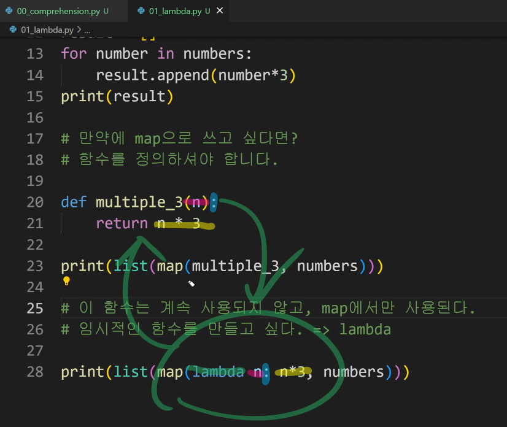
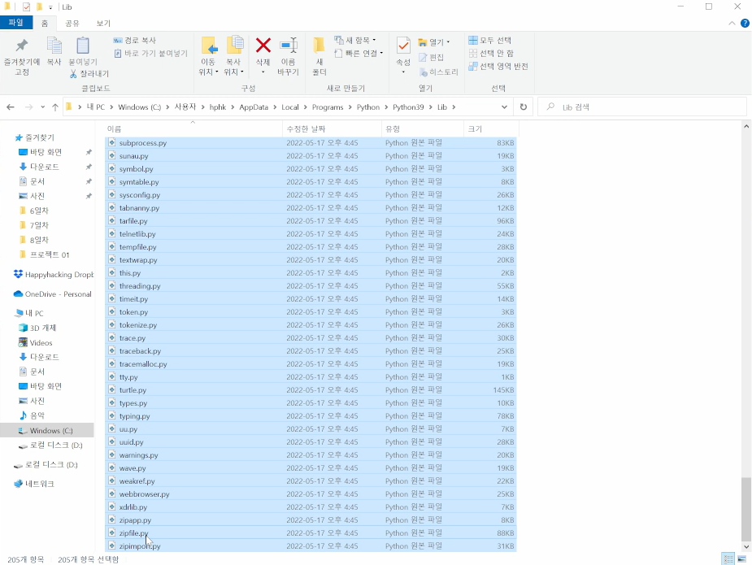
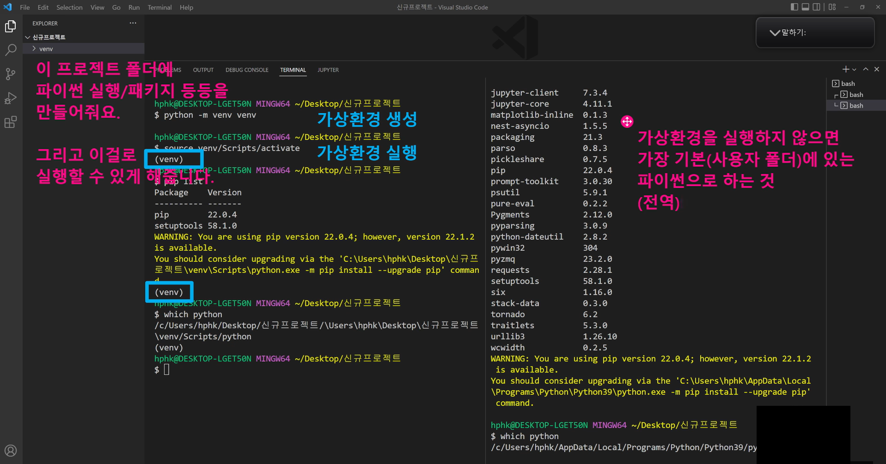

# ✅Python 패키지 활용

> PDF, 강의 내용을 참조하여 보완 예정입니다.
>
> 


파이썬 강의 마지막!


오늘 수업 구성

추가적인 문법들 소개

파이썬 버전의 변화 과정

패키지


## 1. 추가 문법

- List Comprehension
  - 특정한 원소(요소)로 구성된 리스트를 만들 때 활용
  - 아무 때나 사용할 수 있는 것은 아니고, 너무 많이 쓰면 코드의 가독성도 떨어질 수 있음!

- Dictionary Comprehension
  - 키:값 쌍으로 표현되기 때문에 가독성이 좋아짐
  - 컴프리핸션 코드를 보면, 간단한 형태의 리스트/딕셔너리를 만들고 싶었다는 것을 바로 알 수 있음

- lambda [parameter] : 표현식
  - 함수를 응용하는 것으로 이해
  - 이름이 없는 함수(= 정의없이 함수를 만듬)여서 익명 함수라고 불림
  - 함수를 정의해서 사용하는 것보다 간결하게 사용 가능
  - def를 사용할 수 없는 곳에서도 사용 가능





- filter
  - 반복 가능한 것을 넣어서 True 인 것만 filter object 로 반환(map 이랑 비슷한 형태)

- map(function, iterable)
  - 모든 반복 가능한 애들(iterable)에게 함수 적용하고 그 결과를 map object 로 ~ !


---


## 2. 파이썬 버전별 추가된


파이썬은 여러 버전을 설치해놓고, VSCODE 에서 특정 버전 선택해서

작업을 진행할 수 있음

취업하는 회사가 어디냐에 따라 어떤 버전을 사용하는지도

하나의 이슈가 됩니다


버전 호환성이 언어별, 패키지별로 다름

항상 최신 문법이 좋은 것만은 아니다

파이썬 3.8의 새로운 기능을 사용하면, 낮은 버전을 사용하는 작업자와 협업할 때 오류가 발생할 수 있음

언어가 이렇게 달라지고 있다는 것을 아는 정도로 이해하자


파이썬 3.8에서 수업에서 다룰 문법! (파이썬 자습서 참고)

위치 전용 매개 변수


어노테이션은

동적 타입 언어인 파이썬에서 

변수의 타입에 대한 힌트를 주는 것! 그냥 힌트.. 그냥 노트..

함수 어노테이션을 쓰면, x나 y의 타입이 int 라는 힌트만 제공하는 것


---


## 3. 패키지

텐서플로우는 데이터분석할 때 쓰는 기계학습 라이브러리

이 라이브러리를 설치해서 쓰려면?

이 것을 관리하는 관리자 pip 를 활용!


파이썬 표준 라이브러리

이미 내장되어 있는 모듈과 함수를 볼 수 있음




그러나 표준 라이브러리 말고 패키지를 직접 설치하려면 pip 이용

```bash
바탕화면에서 Git bash 실행하고

$ pip list 
치면 컴퓨터에 설치되어 있는 패키지를 확인 가능

$ pip install 패키지명
새로운 패키지 설치하기
파이썬을 설치한 위치에 패키지들이 설치되어 있음
(0721_1.png 참조)

$ pip uninstall 패키지명
설치했던 패키지 삭제하기(오타 등의 오류 발생 시 활용!)
```


가상환경

프로젝트마다 파이썬의 버전이 모두 다를 때, 패키지들을 따로따로 관리할 수 있게 도와주는 것

(0721_2.png 이미지 참조)




장고 배울 때 더 자세히 다뤄볼 예정!


실습문제 1288 접근방법

.png)


