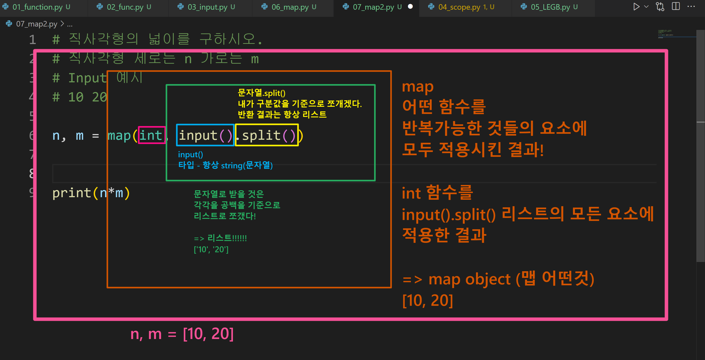

# ✅함수

>PDF 참조해서 내용을 보충할 예정입니다.
>
>1. 함수 기초
>2. 함수의 결과값
>3. 함수의 입력
>4. 함수의 범위
>5. 함수 응용

[파이썬 자습서](https://docs.python.org/ko/3/tutorial/index.html)

[파이썬 표준 라이브러리](https://docs.python.org/ko/3/library/index.html)


* 함수

컴퓨터(Computer)의 정의: ①Calculation + ②Remember

명령적 지식(imperative knowledge): How-to, 어떻게 할 것인가?
※ [중요] 코드의 함정에 빠지지 말고, 
    내가 지금 어떤 명령을 하고 있는지 생각하면서 코딩하자

변수와 타입: int, float, complex, bool, str, list, tuple, range, set, dictionary


* len('happy!') 코드의 결과는 6  (아래 코드와 같다)

```python
word = 'happy!'
cnt = 0
for char in word:
    cnt += 1
```


* sum([1, 10, 100]) (아래 코드와 같다)

```python
numbers = [1, 10, 100]
result = 0
for number in numbers:
	result += number
```


* 함수를 사용하는 이유

1)Decomposition: 기능을 분해해서 재사용이 가능

```Python
# 상황1)
numbers = [1, 10, 100]
result = 0
cnt = 0
for number in numbers:
	result += number
	cnt += 1
print(result/cnt)

# 상황2)
print(sum(numbers)/len(numbers))

# 상황1 과 상황2 는 같다(그러나 상황2가 훨씬 간결!)
```


2)Abstraction: 복잡한 내용을 숨기고 기능에 집중하여 사용할 수 있음(블랙박스)

재사용성, 가독성, 생산성

```python
name = '파이썬'
# 파이썬이라는 문자열을 name 에 할당하고 있음
# 수많은 데이터 중에 어떤 것을 선택해 이름을 부여해 쓰고 있음

print('happy hacking!')
# 문자열 'happy hacking!' 을 넣으면, 이걸 출력해준다는게
# print()가 보장해주는 약속!
```


위의 내용을 종합했을때, 

함수란, '블랙박스에 Input 을 넣으면, Output 을 줄게!' 하는 약속


---


## 1. 함수 기초

* 함수의 정의

특정 기능을 하는 코드의 조각(묶음)

특정 명령을 수행하는 코드를 매번 다시 작성하지 않고, 필요 시에만 호출하여 간편히 사용


함수를 사용해야 하는 이유

코드 중복 방지 / 재사용 용이


* 선언과 호출

함수의 선언은 def 키워드를 활용함

들여쓰기를 통해 실행될 코드 블록을 작성함

함수는 parameter 를 넘겨줄 수 있음

함수는 호출되면 동작(코드 실행) 후에 리턴을 통해 결과값을 전달함

```python
def foo():           # 소괄호를 쓰는 것 = 함수 호출
    return True
def add(x, y):       # add(2, 3) <- 직접 호출
    return x + y

+++++++++++++++++++++++++++++++

[직접 해보기]
def add(a, b):       # add: 함수 이름 짓기, Input: a, b
    return a + b     # return: 값을 반환

def add(a, b):      
    return a + b
print(add(5, 10))    # 위와 같이 정의한 다음, 5+10 결과를 얻고 싶을때

def minus(a, b):      # minus: 함수 이름 짓기, Input: a, b
    return a - b
print(minus(10, 5))   # 호출

print(sum([1, 2, 3]))   # 내장함수 호출

+++++++++++++++++++++++++++++++

[예시]
num1 = 0
num2 = 1

def func1(a, b):                      # ③ func1 이 뭔지 확인
    return a + b

def func2(a, b):                      # ④ func2 가 뭔지 확인
    return a - b

def func3(a, b):                       # ② func3 이 뭔지 확인
    return func1(a, 5) + func2(5, b)

result = func3(num1, num2)             # ① 호출
print(result)                          # 결과값 5 + 4 = 9
```


---


## 2. 함수의 결과값

함수는 반드시 값을 하나만 return 한다.

값이 없으면 None

함수는 return 과 동시에 실행이 종료된다.

아래 코드의 문제점은 뭘까?

```python
def minus_and_product(x, y):
    return x - y       # 여기서 return 하며 실행이 종료되므로
	return x * y       # 이 부분은 평~~~생 동작하지 않음!
```


* 튜플 반환: 두개 이상 값을 반환하고 싶을 때

```python
def minus_and_product(x, y):
    return x - y, x * y

+++++++++++++++++++++++++++++++

def foo():
    return 1, 2

result = foo()
print(result, type(result))   # 이렇게 프린트해보면 하나로 묶은 튜플만
                              # 반환된 것을 확인할 수 있음

+++++++++++++++++++++++++++++++
    
def no():
    a = 1
    
result = no()
print(result, type(result))   # 이렇게 프린트해보면 
                              # <class 'Nonetype'>
    
+++++++++++++++++++++++++++++++

# 초반에 많이 하는 실수
# print() 함수는 출력이라는 '행위'만 하기 때문에
# return 값은 없다! (=None)

a = print('hi')
print(a)             
= 이런식으로 코드를 짜면 안된다
```


---


## 3. 함수의 입력

* parameter vs argument

parameter : 함수를 실행할 때, 함수 내부에서 사용되는 식별자

argument : 함수를 호출할 때, 넣어주는 값

```python
def function(ham):
    return ham

function('spam')
```


* argument 

함수 호출 시 함수의 parameter 를 통해 전달되는 값

argument 는 소괄호 안에 할당 func_name(argument)


* positional arguments

위치로 파악하기(기본)

기본적으로 함수 호출 시 argument 는 위치에 따라 함수 내에 전달됨


* keyword arguments

직접 변수의 이름으로 특정 argument를 전달할 수 있음

keyword argument 다음에 positional argument 를 활용할 수 없음

```python
print('hi', 'hello', sep='-')
# hi-hello 도출
# 이때, sep= 가 keyword argument !
```


* Default Argument Values

기본값을 지정하여 함수 호출 시 argument 값을 설정하지 않도록 함

```python
print('hi', 'hello')
# hi hello 도출
# print() 에 설정된 sep= 의 기본값(Default)이 스페이스 한 칸 이므로 !
```


* 정해지지 않은 개수의 arguments

여러 개의 positional argument 를 하나의 필수 parameter 로 받아서 사용

몇 개의 positional argument 를 받을지 모르는 함수를 정의할 때 유용

```python
print(1, 2, 3, 4, 5, 6, 7, 8)
# 1, 2, 3, 4, 5, 6, 7, 8 출력

+++++++++++++++++++++++++++++++

def my_add(*numbers):
    return numbers

result = my_add(1, 2, 3)
print(result, type(result))
# (1, 2, 3) 은 내부적으로 tuple 이라고 출력!
```


* 정해지지 않은 개수의 arguments

함수가 임의의 개수 argument 를 묶어 keyword argument로 호출될 수 있도록 지정

argument 들은 딕셔너리로 묶여 처리되며, parameter 에 **을 붙여 표현

```python
def my_func(**kwargs):
    return kwargs

result = my_func(name='홍길동', age='100', gender='M')
print(result, type(result))
# 키-값 묶여있으므로 딕셔너리라고 출력됨
```


---


## 4. 함수의 범위

함수는 코드 내부에 local scope를 생성하며, 그 외의 공간인 global scope 로 구성

```python
def foo():
    a = 1
    
foo()
print(a)
# 오류가 난다!
```


* 객체는 각자의 생명주기가 존재

빌트인(B) 스코프: print, sum, len ... 파이썬이 처음부터 만들어둔 스코프

글로벌(G) 스코프: a=3 처럼 사용자가 직접 지정

로컬(L) 스코프: def 로 함수를 만들어서, 그 안에서 유지되는 스코프


* 이름 검색 규칙

파이썬에서 사용되는 이름(식별자)들은 이름공간에 저장되어 있음

LEGB Rule: 파이썬은 L -> E -> G -> B 순서로 읽음

즉 함수 내에서는 바깥 스코프의 변수에 접근 가능하나 수정은 할 수 없음

```python
sum = 5
print(sum([1, 2, 3]))
# 빌트인 스코프에 sum 함수가 있었는데
# 글로벌 스코프에 sum 이라는 이름의 변수를 만들었음
# 파이썬은 L -> E -> G -> B 순서로 읽으니까 결국 오류가 난다!
*E는 생략하고 나중에 설명!

+++++++++++++++++++++++++++++++

name = '홍길동'                   # 이걸 쓰고 싶다면

def add(a, b, c, name):          # 이렇게 넣거나
    return

def add(a, b, c):
    name = '홍길동'                # 이렇게 넣자
    return 
```


## 5. 함수 응용

* map
  * 순회 가능한 데이터구조의 모든 요소에 함수 적용하고 그 결과를 map object로 반환

```python
numbers = ['1', '2', '3']
# 위 안에 있는 모든 것을 숫자로 바꿔서 쓰고 싶다면?

n = int(numbers)
# 이러면 오류가 남
# 형 변환할 때, 리스크를 숫자로 바꾸는 것은 불가능!
# 다만, 숫자 형태의 문자를 변환하는 것은 가능!

a = int(numbers[0])
b = int(numbers[1])
c = int(numbers[2])
new_numbers = [a, b, c]
# 이런 식으로 하나하나 지정하는 것
# 그러나 그 개수가 100개, 1000개라면..?

new_numbers = []
for number in numbers:
    new_numbers.append(int(numbers))
print(new_numbers)
# 반복문 활용하는 방법
# int 함수를 '1', '2', '3'에 각각 적용하고 싶은게 사용자의 의도

# 위의 과정을 쉽게 만들어 주는 것이 map !
numbers = ['1', '2', '3']
new_numbers2 = map(int, numbers)
print(new_numbers2)       # 이렇게 보면 map 객체로 저장되어 있다고 뜸
print(list(new_numbers2)) # map 객체를 list 로 형 변환해서 보기
print(new_numbers2, type(new_numbers2)) # type map 이라고 뜸
# 반드시 list 로 바꿔야 하는 것은 아니에요 ~

+++++++++++++++++++++++++++++++

map 의 활용 방식
사용자에게 input 을 받았을 때 국룰임

[예제]
직사각형의 넓이를 구하시오
직사각형의 세로는 n, 가로는 m
input 예시: 10, 20

n, m = map(int, input().split())
print(n*m)
# 위 코드에 대한 해설은 하단 첨부 이미지 참조
```




* map 응용

```python
내장함수를 10을 다 더해주는 함수가 있음

def plus10(n):
    return n + 10

numbers = [10, 20, 30]
new_numbers = list(map(plus10, numbers))
print(new_numbers)
# [20, 30, 40] 출력
```

