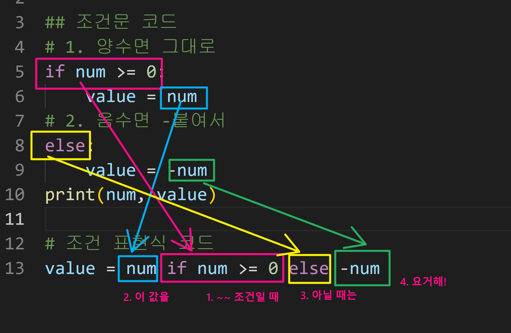

# ✅제어문(조건문/반복문)

> PDF 참조해서 내용을 보충할 예정입니다.
>
> 1. 제어문이란?
> 2. 조건문
> 3. 반복문

[학습에 도움되는 사이트: 파이썬 튜터](https://pythontutor.com/)


## 1. 제어문(Control Statement)

제어문이란?

파이썬은 기본적으로 위에서부터 아래로 순차적으로 명령을 수행

특정 상황에 따라 코드를 선택적으로 실행(분기/조건)하거나 계속하여

실행(반복하는 제어가 필요함)

제어문은 순서도(flow chart)로 표현이 가능

조건문, 반복문


---


## 2. 조건문

조건문은 참/거짓을 판단할 수 있는 조건식과 함께 사용

코드 블록을 실행한 다음, 다음 코드를 실행하는 형식

조건문의 기본 형식

```python
if < expression >;
    # Run this Code block    <- 참일때 실행
else:
    # Run this Code block    <- 거짓일때 실행(선택적, 직접조건X)

+++++++++++++++++++++++++++++++

<예제1>
아래의 순서도를 코드로 나타내세요(pdf 참조)
◇ 부분: 참, 거짓을 확인하는 조건
a = -10
if a >= 0:
    print('양수')   # -10 은 음수이므로 여기는 실행되지 않음
else: 
    print('음수')   # -10 은 음수이므로 여기가 실행됨
print(a)           # 출력되는 결과는 '음수' -10
여기서 Terminal에 $ python 파일명.py 입력해서 결과 얻기

+++++++++++++++++++++++++++++++

<예제2(실습 문제)>
예제1에서 a가 홀수인지 확인하고 싶다면?
[조건문을 통해 변수 num 값의 홀수/짝수 여부를 출력하시오
 *이때 num 은 input을 통해 사용자로부터 입력 받으시오]
◇ 부분: 2를 나눈 나머지가 1인지?
num = input()
print(num)              #input을 제대로 받고 있는지 반드시 확인!
print(num, type(num))   #num의 타입이 문자열인지, 숫자인지 확인
이때 <class 'str'> 즉, 문자열이라는 결과가 출력되기에
숫자(정수) 결과를 얻기 위해 아래와 같이 코드를 수정해야 함(형 변환)
num = int(input())

if num % 2 == 1:
    print('홀수')
else:
    print('짝수')
여기서 Terminal에 $ python 파일명.py 입력해서 정상 실행되는지 확인
```


복수조건문

홀수, 짝수가 아니라 여러 구간으로 나누어서 결과를 확인하고 싶을 때

ex) 90점~100점: A, 80점~89점: B, 70점~79점:C ... 를 출력하고 싶을 때!

복수의 조건식을 활용할 경우 **elif**를 활용하여 표현함

```python
if <expression>:
    # Code block
elif <expression>:
    # Code block
elif <expression>:
    # Code block
else:
    # Code block
    
+++++++++++++++++++++++++++++++

<실습문제>
다음 미세먼지 농도에 따른 등급일 때,
dust 값에 따라 등급을 출력하는 조건식을 작성하시오.
dust = 100
# dust 가 150보다 크면, 매우 나쁨
if dust > 150:
    print('매우 나쁨')
#          80보다 크면, 나쁨
elif dust > 80:
    print('나쁨')
#          30보다 크면, 보통
elif dust > 30:
    print('보통')
# 좋음
else:
    print('좋음')
여기서 Terminal에 $ python 파일명.py 입력해서 결과 얻기

※ 위에서 주의해야 하는 실수! ※
 elif 쓰다보니 else 에도 조건을 추가해버림
 그러나 else 는 위의 조건을 제외한 나머지 전부기 때문에
 절대로 추가적인 조건문 쓰면 안됨!
 심지어 else 는 상황에 따라 생략해도 결과가 출력됨
```


중첩조건문

조건문을 다른 조건문에 중첩되어 사용할 수 있음

```python
if <expression>:
        # Code block
    if <expression>:
        # Code block
else:
        # Code block

+++++++++++++++++++++++++++++++
        
<실습문제>
(pdf 참조)
dust = -10

if dust > 150:
    print('매우 나쁨')
elif dust > 80:
    print('나쁨')
elif dust > 30:
    print('보통')
else:
    if dust < 0:
        print('음수 값입니다.')
    else: 
    print('좋음')
여기서 Terminal에 $ python 파일명.py 입력해서 결과 얻기
```


조건 표현식(이런게 있다! 정도로만 이해하자)

조건문을 다른 형식으로 쓸 수 있는 방법

조건 표현식을 일반적으로 조건에 따라 값을 정할 때 활용

프린트할 땐 안쓰고, 상황에 따라 

```python
<실습문제>
value = num if num >= 0 else -m

num이 정수일 때,
위 코드는 어떤 코드일까요?
답: 절댓값을 만드는 코드
    
value = num  # 참일 경우
if num >= 0
else -m      # 거짓일 경우

위 코드가 if문이었다면?
num = -10
if num >= 0:
    value = num
else:
    value = -num
print(num, value)    # 양수면 그대로, 음수면 -붙여서

# 조건 표현식 코드: 위의 코드를 아래와 같이 변형
# 원리는 하단 이미지 파일 참조
value = num if num >= 0 else -num
```




---


## 3, 반복문

while, for


반복문

특정 조건에 도달할 때까지 반복되는 일련의 문장

① while 문: 종료조건에 해당하는 코드를 통해 반복문을 종료시켜야 함

② for 문: 반복가능한 객체를 모두 순회하면 종료(별도의 종료조건의 필요없음)

④ 반복제어: break, continue, for-else


while 

while문은 조건식이 참인 경우 반복적으로(=무한) 코드를 실행

조건이 참인 경우 들여쓰기 되어 있는 코드 블록이 실행됨

코드 블록이 모두 실행되고, 다시 조건식을 검사하며 반복적으로 실행됨

while 문은 무한 루프를 하지 않도록 종료조건이 반드시 필요

```python
while <expression>:
    # Code block
    
+++++++++++++++++++++++++++++++
    
<예제>
아래의 순서도를 코드로 나타내세요(pdf 참조)
# Q: 하단의 코드는 몇 번 반복될까? / A: 5회
a = 0
while a < 5:    # 종료조건에 해당하는 부분
    print(a)
    a += 1      # a = a+1 의미
print('끝')

+++++++++++++++++++++++++++++++

<실습문제>
1부터 사용자가 입력한 양의 정수까지 총합을 구하는 코드를 작성하시오

# <풀이 절차>
# 매 회 n 이 1씩 증가해야하고
# 매 회 result 에는 n을 더해야함
# 종료는 n = user_input 보다 커졌을 때
# (True일땐 작거나 같을 때)

n = 0                       # 처음 시작 값
result = 0                  # 0부터 더하기 위해서
user_input = int(input())   # user_input 값
while n <= user_input:
    result += n
    n += 1
print(result)
여기서 Terminal에 $ python 파일명.py 입력해서 정상 실행되는지 확인

+++++++++++++++++++++++++++++++

# 실습문제 Q: 그냥 n<user_input 하면 안되나요?
# 실습문제 A: (하단의 상황1, 상황2 비교해보기)

# 새로운 상황! n < user_input 를 아래와 같은 코드로 작성
n = 0
result = 0
user_input = int(input())
while n < user_input:
    n += 1
    result += n
print(result)
여기서 Terminal에 $ python 파일명.py 입력해서 정상 실행되는지 확인
처음의 실습문제 풀이와 동일한 값이 출력되는지 확인!

# [상황1,2 비교] 위 상황들이 실제로 어떻게 진행되는 것인지 디버깅 해보기

상황1)
while n <= user_input:
    print(f'n: {n}, result: {result}')   # 이 코드를 추가
    result += n
    n += 1
print(result)

상황2)
while n < user_input:
    print(f'n: {n}, result: {result}')   # 이 코드를 추가
    n += 1
    result += n
print(result)

# [상황1,2 비교] <- 위의 코드들 사이에 print 추가해서
# 내가 보기 편하게끔 바꿔나가야 함(아래 코드를 순차적으로 확인)
n = 0
result = 0
user_input = int(input())
while n <= user_input:
    print(f'n: {n}, result: {result}')  # 작업상황 확인용 추가코드
    result += n
    n += 1
print(result)

n = 0
result = 0
print('=============')       # 요런 줄을 추가해서 상환1,2 사이 코드 가독성 높임
while n < user_input:
    print(f'n: {n}, result: {result}') # 작업상황 확인용 추가코드
    n += 1
    result += n
print(result)
```


for

for문은 시퀀스(스트링, 튜플, 리스트 ..)를 포함한 순회가능한 객체(iterable)요소를 모두 순회함

처음부터 끝까지 모두 순회하므로 별도의 종료조건이 필요하지 않음

```python
for <변수명> in <반복 가능한 아이(iterable)>:
    # Code block

+++++++++++++++++++++++++++++++
    
<예제>
아래의 순서도를 코드로 나타내세요(pdf 참조)
for fruit in ['apple', 'mango', 'banana']:
    print(fruit)
print('끝')
```


문자열 순회(1)

사용자가 입력한 문자를 한 글자씩 세로로 출력하시오

```python
chars = input()
# hi 출력

for char in chars:
    print(char)
# h
# i 출력
```


문자열 순회(2)

사용자가 입력한 문자를 **range** 를 활용하여 한 글자씩 세로로 출력하시오

위(1)와 동일하지만, index 를 기준으로 순회한다는 특징/장점이 있음

(= 인덱스로 접근해서 씀, 실제 알고리즘 활용할 땐 이 방법을 더 많이 사용)

```python
chars = input()
# hi 출력

# range(len(chars)) 활용!
for idx in range(len(chars)):
    print(chars[idx])
```


enumerate 순회(심화)

튜플을 활용

알고리즘 때 잘 안쓰고, (2) 위주로 많이 사용하게 됨


딕셔너리 순회

딕셔너리는 기본적으로 key를 순회하며, key를 통해 값을 활용

```python
grade = {'john': 80, 'eric': 90}
for name in grade:
    print(name)
    
# john
# eric      이와 같이 키만 출력됨

+++++++++++++++++++++++++++++++

# 위의 상황에서 값과 같이 출력하고 싶다면?

grade = {'john': 80, 'eric': 90}
for name in grade:
    print(name, grades[name])

# john 80
# eric 90    이와 같이 키-값이 같이 출력됨
```


반복문 제어

반복문을 어떻게 멈출 수 있을까?

break: 반복문을 종료

continue: continue 이후의 코드 블록은 수행하지 않고, 다음 반복을 수행

for-else: 끝까지 반복문을 실행한 이후 else문 실행

​                break 통해 중간에 종료되는 경우 else문은 실행되지 않음


break 예시로 이해하기

```python
break문을 만나면 반복문은 종료됨

상황1)
  n = 0
  while True:
      if n == 3:
            break
      print(n)
      n += 1
# 0
# 1
# 2 출력
        
상황2)
  for i in range(10):
        if i > 1:
            print('0과 1만 필요해!')
            break
        print(i)
# 0
# 1
# 0과 1만 필요해!     출력
```


continue 예시로 이해하기

```python
continue 이후의 코드 블록은 수행하지 않고, 다음 반복을 수행

for i in range(6):
    if i % 2 == 0
        continue
    print(i)
# 1
# 3
# 5  출력
```


for-else 예시로 이해하기

```python
상황1)
  for char in 'apple':
      if char == 'b':
          print('b!')
          break
  else:
      print('b가 없습니다.')
# b가 없습니다.  출력
    
상황2)
  for char in 'banana'
      if char == 'b'
          print('b!')
          break
  else:
      print('b가 없습니다.')
# b!  출력
```

