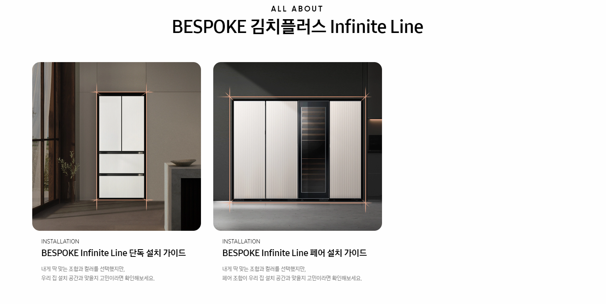

# 실습 1

> 아래의 내용을 참고하여 만들어봅시다. 색상, 크기 및 문구는 변경 가능합니다.

## 상단 문구

* 상단 문구는 `h2` 태그를 활용하여 작성합니다.

* ALL ABOUT의 글씨 크기만 12px로 변경하고 줄바꿈을 합니다.

## 카드

* 카드들의 전체 영역의 너비는 900px입니다.

* 개별 카드 아이템(이미지 및 텍스트)의 너비는 300px입니다.

* 이미지는 `images` 폴더를 활용합니다. 

