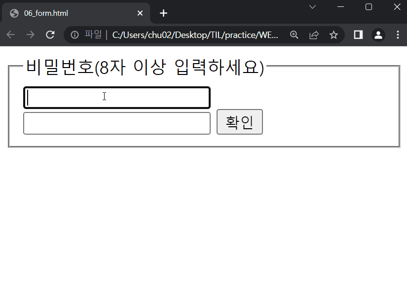

# 2022-09-19 / 14일차 실습

> JavaScript EVENT 구현하기

---

### `01_button.html`

---

### `02_input.html`

---

### `03_prevent.html`

---

### `04_modal.html`

---

### `05_carousel.html`

---

### `06_form.html`

---

### 💡실습 후기

- "**특정 이벤트가 발생**하면, **할 일(함수)을 등록**한다."
- DOM 요소를 수정, 변경, 삭제하는 다양한 이벤트를 만들어보았습니다.